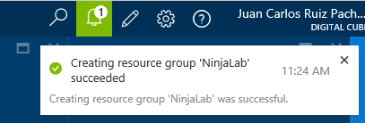
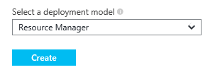
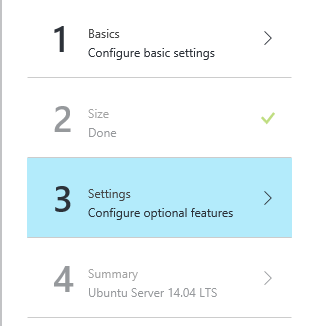
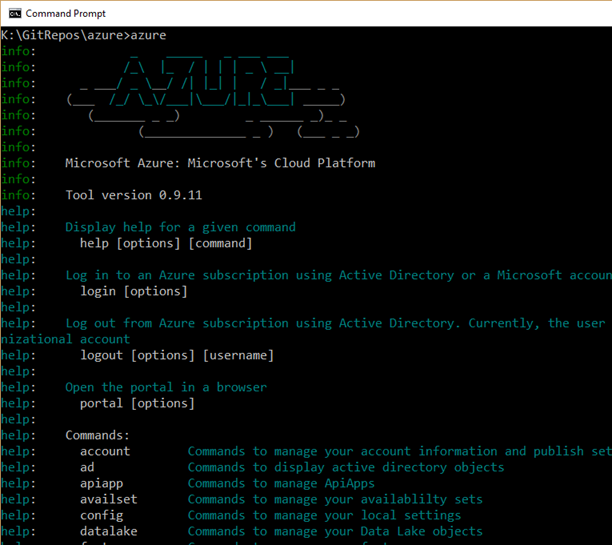

#Parte 1 - Creación de recursos 
<span class="alert alert-info">
Los titulos estan en español y los screenshos en inglés de forma intencional para poder guiar a personas con el portal configurado en cualquier de los dos idiomas</span>

<span id="Tarea1" />
##Tarea 1 - Creación de recursos desde el desde el portal
1. Ingresa e inicia sesión en http://portal.azure.com
1. Damos click en "Grupo de Recursos"

	
1. Seguidamente damos click adicionar 

	
1. En el panel que se abre ponemos como nombre al grupo de recursos "NinjaLab", nos aseguramos de tener el checkbox habilitado y damos click en crear

	
1. Recibiermos una notificación cuando el cambio se haya aplicado

	
1. Desde el menú principal damos click en "Nuevo", "Computo" y finalmente en "Ubuntu Server" tal como se ve en la gráfica

	
1. En la parte inferior del nuevo panel abierto seleccionamos "Administrador de recursos" y damos click en "Crear"

		
1. El panel "Básico" se abre automáticamente, allí establecemos como nombre de la máquina virtual el que desees, en este caso "ninja-vm", debes utilizar otro nombre porque seguro este ya estará utilizado.
1. Ingresamos como nombre del administrador "ninja-admin" y en password aségurte de usar uno que puedas recordar.
1. Damos click en "Grupo de recursos"  y en la lista desplegada seleccionamos "Ninja-Lab"

		
1. Damos click en "Crear", luego de esto estaremos en la etapa "2 - Tamaño "
1. En el panel que se abre podemos escoger un tamaño para la máquina virtual, antes de escogerlo damos click en "Ver todo" para ver todas las opciones posibles.

		
1. De las opciones desplegadas selecionamos "A2 Standard" y damos click en el botón de la parte de abajo que dice "Seleccionar"
1.  Ahora estamos en la etapa "3 - Configuración"

	
1. Aquí podemos seleccionar el tipo de almacenamiento para la MV, la configuración de la red , el monitoreo y los grupos de disponibilidad. Sin embargo para efectos de este laboratorio las opciones por defecto funcionan de manera adecuada, así que damos click en "OK".

	
1. Ahora estamos en la etapa 4, que no es otra cosa que el resumen de las configuraciones que acabamos de hacer. Damos click en "OK"
1. En este punto los 4 item de la lista deben aparecer con un check verde, sino es así navega por ellos y acepta los cambios en cada uno.
1. Se generará una notificación indicando que se esta creando el recurso, en este caso una máquina virtual.

	
1. Este último paso tomará unos minutos, pero una vez finalice tu máquina virtual estará creada. **Puedes seguir avanzando con otras tareas del laboratorio** mientras el proceso sigue adelante.
1. Una vez termina el proceso recibiras una nueva notificación en el portal

	
1. Descarga el [PuTTY](http://the.earth.li/~sgtatham/putty/latest/x86/putty.exe) para conectarte remotamente a tu máquina virtual
1. Desde PuTTY conétate con los datos de tu MV, utiliza la dirección IP pública que aparece en el dashboard de la MV en el portal de Azure

	
1. Al aparecer la siguiente pantalla ingresa como administrador "ninja-admin" y utliza el password que estableciste previamente

	
1. Fin 

<span id="Tarea2" />
##Tarea 2 - Configurar la consola multiplataforma de Azure

1. Desde la consola de comandos escribir `azure` y presionar ENTER, si tienes instalada la consola multiplataforma de Azure aparecerá lo siguiente en pantalla de lo contrario debes instalarla desde aquí: [Xplat](http://go.microsoft.com/?linkid=9828653&clcid=0x40a)

	
1. Para efectos de este NinjaLab debemos configurar la consola de comandos de Azure en modo ARM (Azure Resource Manager) que es como seguira evolucionando Azure en adelante.

	```bash session
	azure config mode arm
	```
1. Seguidamente ingresamos este comando, el cual arroja un mensaje similar al que se ve abajo

	```bash session
	azure login
	```
	```bash session
	To sign in, use a web browser to open the page http://aka.ms/devicelogin. 
	Enter the code FR6MCKRPA to authenticate. 
	If you're signing in as an Azure AD application, 
	use the --username and --password parameters.
	```
1. Así que... hacemos caso vamos a http://aka.ms/devicelogin en el browser y allí ingresamos el código que aparecio por la consola, en este caso `FR6MCKRPA` y damos click en continuar

	
1. Luego de ello iniciamos sesión en el browser, y despues de unos segundos en la consola aparecerá

	```bash session
	login command OK
	```
1. Puede que tengas varias suscriptiones de azure asociadas al mismo live Id, con este comando listamos las suscripciones disponibles

	```bash session
	azure account list
	```
	```bash session
	data:    Name                       Id                                    Current  State
	data:    -------------------------  ------------------------------------  -------  -------
	data:    MSDN - MSFTE               adcbda71-4f93-427c-9ce0-fd7d100a4e1d  true     Enabled
	data:    MSDN - MVP                 e5a421e7-e4b5-4eda-8512-d810d21040dc  false    Enabled
	data:    Demos Azure Subscriptions  cbf6d47d-b985-4018-ac3a-9da7a60a092e  false    Enabled
	```
1. de la lista desplegada idenifica cual corresponde a la suscripción con la que deseas trabajar, en mi caso "MSDN - MSFTE" así que ingreso el siguiente comando para establecerla como predeterminada

	```bash session
	azure account set "MSDN - MSFTE"
	```
1. Finalmente ingresamos este comando y verificamos que todo este en orden

	```bash session
	azure account show	
	```	
	```bash session
	info:    Executing command account show
	data:    Name                        : MSDN - MSFTE
	data:    ID                          : adcbda71-4f93-427c-9ce0-fd7d100a4e1d
	data:    State                       : Enabled
	data:    Tenant ID                   : bcc54008-4288-4ccd-b041-3225637c7154
	data:    Is Default                  : true
	data:    Environment                 : AzureCloud
	data:    Has Certificate             : No
	data:    Has Access Token            : Yes
	data:    User name                   : jnk@outlook.com
	```
1. Fin - NHK

<span id="Tarea3" />
##Tarea 3 - Creación de una máquina virtual desde la línea de comandos multiplataforma

1. Lo primero que debemos crear es un "Grupo de Recursos", lo llamaremos NinjaLabCMD

	```bash session
	azure group create -n NinjaLabCMD -l EastUS
	```
1. Crearemos una MV por consola, para ello necesitamos establecer los mismos parámetros de creación que en nuestra má1quina creada en la [Tarea 1](#Tarea1), esos son los pasos que seguiremos a continuación para crear el comando
1. Para crear una máquina virtual desde Xplat se pueden usar cualquiera de los siguientes comandos, Si los ejecutas cada uno seguido del comando -h obtendrás ayuda de la consola

	```bash session
	azure vm quick-create
	azure vm create
	```
1. Para efectos de este NinjaLab haremos uso de `quick-create` el cual nos permite crear la MV con un mínimo de opciones, para una configuración completa es necesario hacer uso de `create`.
1. Ingresamos este comando para establecer el grupo de recursos y el nombre de la máquina virtual, recuerda escoger un nombre de MV diferente al del ejemplo, que de seguro ese ya esta usado

	```bash session
	azure vm quick-create -g NinjaLabCMD -n ninja-vm-cmd 
	```  
1. Presiona *(Ctrl + C)* 2 veces y luego ENTER para cancelar el comando, ya que te pide parámetros adicionales
1. El primer parámetro adicional que necesitamos es la ubicación de la MV, como no sabemos lsa ubicaciones ingresamos el siguiente comando para obtenerlas

	```bash session
	azure location list > Locations.csv
	```
1. Esto genera un archivo separado por comas donde se listan todas las ubicaciones para cada uno de los servicios de Azure, puedes manipular este archivo desde excel para determinar las ubicaciones permitidas para el servicio de máquinas virtuales.
1. Sin embargo ya he hecho ese trabajo por ti, estos son los valores permitidos, al usarlos en la consola se deben suprimir los espacios en blanco
	* Brazil South
	* Central US
	* East Asia
	* East US
	* Japan East
	* Japan West
	* North Central US
	* North Europe
	* South Central US
	* Southeast Asia
	* West Europe
	* West US
1. Así que seleccionaremos la ubicación "EastUS", por lo que nuestro script ahora luce así. Al ejecutarlo pedirá más parámetros, cancela nuevamente la ejecución

	```bash session
	azure vm quick-create -g NinjaLabCMD -n ninja-vm-cmd -l EastUS
	```
1. El siguiente parámetro es el tipo de OS que queremos instalar, le indicaremos "Linux", ejecutalo pero de nuevo cancela la ejecución.

	```bash session
	azure vm quick-create -g NinjaLabCMD -n ninja-vm-cmd -l EastUS -y Linux
	```
1. Seguidamente adicionamos parámetros para el usuario y la contraseña, ejecutalo pero de nuevo cancela la ejecución.

	```bash session
	azure vm quick-create -g NinjaLabCMD -n ninja-vm-cmd -l EastUS -y Linux -u ninja-admin -p TUPASSWORD
	```
1. Ahora las cosas se ponen más interesantes, si seguiste los pasos la consola te estará pidiendo el parámetro `ImageURN` en el cual pones `Canonical:UbuntuServer:14.04.2-LTS:14.04.201507060` y LISTO... HEY pero estos son **NinjaLabs** para que te vuelbas un duro, un maestro!! de dónde sale ese valor
1. Para obtener ese valor debemos seguir los siguientes pasos, ese varlor es basicamente el medio (imagen) de instalación que usaremos para instalar Ubuntu, si recuerdas la [Tarea 1](#Tarea1) El OS que seleccionamos era **Ubuntu Server 14.04 LTS** así que navegaremos por la consola de comandos para que con ese datos logremos obtener el `ImageURN`
1. Con el siguiente comando obtendremos la lista de publishers que han publicado imagenes de MV en Azure, lo único 'raro' allí es la ubicación, pero ya aprendimos de donde se obtienen

	```bash session
	azure vm image list-publishers -l EastUS
	```
1. Ejecutar este comando nos trae una lista bastante larga, pero sabemos que Ubuntu es creado por "Canonical" así que buscaremos algo parecido a "Canonical" en la lista y allí deberiamos encontrar lo siguiente

	```bash session
	data:    Publisher                                             Location
	data:    ----------------------------------------------------  --------
	...
	data:    bwappengine                                           eastus
	data:    Canonical                                             eastus
	data:    catechnologies                                        eastus
	data:    cautelalabs                                           eastus
	data:    cds                                                   eastus
	```
1. Ahora que tenemos certeza de como Azure 'conoce' a "Canonical" le preguntaremos que ofertas de imagen tiene canonical en Azure

	```bash session
	azure vm image list-offers -l EastUs -p Canonical
	```
	```bash session
	data:    Publisher  Offer                    Location
	data:    ---------  -----------------------  --------
	data:    Canonical  Ubuntu15.04Snappy        eastus
	data:    Canonical  Ubuntu15.04SnappyDocker  eastus
	data:    Canonical  UbunturollingSnappy      eastus
	data:    Canonical  UbuntuServer             eastus
	```
1. La que nos interesa es `UbuntuServer`, ahora necesitamos conocer que versiones de `UbuntuServer` soporta "Canonical" en Azure , y esa pregunta la hacemos de las siguiente manera

	```bash session
	azure vm image list-skus -l EastUS -p Canonical -o UbuntuServer
	```
	```bash session
	data:    Publisher  Offer         sku                Location
	data:    ---------  ------------  -----------------  --------
	data:    Canonical  UbuntuServer  12.04.2-LTS        eastus
	data:    Canonical  UbuntuServer  12.04.3-LTS        eastus
	data:    Canonical  UbuntuServer  12.04.4-LTS        eastus
	data:    Canonical  UbuntuServer  12.04.5-DAILY-LTS  eastus
	data:    Canonical  UbuntuServer  12.04.5-LTS        eastus
	data:    Canonical  UbuntuServer  12.10              eastus
	data:    Canonical  UbuntuServer  14.04-beta         eastus
	data:    Canonical  UbuntuServer  14.04.0-LTS        eastus
	data:    Canonical  UbuntuServer  14.04.1-LTS        eastus
	data:    Canonical  UbuntuServer  14.04.2-LTS        eastus
	data:    Canonical  UbuntuServer  14.04.3-DAILY-LTS  eastus
	data:    Canonical  UbuntuServer  14.04.3-LTS        eastus
	data:    Canonical  UbuntuServer  14.10              eastus
	data:    Canonical  UbuntuServer  14.10-beta         eastus
	data:    Canonical  UbuntuServer  14.10-DAILY        eastus
	data:    Canonical  UbuntuServer  15.04              eastus
	data:    Canonical  UbuntuServer  15.04-beta         eastus
	data:    Canonical  UbuntuServer  15.04-DAILY        eastus
	data:    Canonical  UbuntuServer  15.10              eastus
	data:    Canonical  UbuntuServer  15.10-alpha        eastus
	data:    Canonical  UbuntuServer  15.10-beta         eastus
	data:    Canonical  UbuntuServer  15.10-DAILY        eastus
	```
1. Al terminar la lista identificamos que hay varias versiones de "Ubuntu 14.04 LTS" así que seleccionaremos la más reciente, en este caso `14.04.3-LTS`
1. Ahora que ya tenemos esos datos probemos preguntando a Azure la lista de imagenes y sus correspondientes URN con este comando

	```bash session
	azure vm image list EastUS Canonical
	```
1. Genial hay tantas que no se puede ni leer, pero para eso tenemos los parámetros adicionales
	* Canonical
	* East US
	* Ubuntu Server
	* 14.04.3-LTS
	
 	```bash session
	 azure vm image list -l EastUS -p Canonical -o  
	```
	```bash session
	data:    Publisher  Offer         Sku          OS     Version          Location  Urn
	data:    ---------  ------------  -----------  -----  ---------------  --------  --------------------------------------------------
	data:    Canonical  UbuntuServer  14.04.2-LTS  Linux  14.04.201503090  eastus    Canonical:UbuntuServer:14.04.2-LTS:14.04.201503090
	data:    Canonical  UbuntuServer  14.04.2-LTS  Linux  14.04.201505060  eastus    Canonical:UbuntuServer:14.04.2-LTS:14.04.201505060
	data:    Canonical  UbuntuServer  14.04.2-LTS  Linux  14.04.201506100  eastus    Canonical:UbuntuServer:14.04.2-LTS:14.04.201506100
	data:    Canonical  UbuntuServer  14.04.2-LTS  Linux  14.04.201507060  eastus    Canonical:UbuntuServer:14.04.2-LTS:14.04.201507060
	```
1. En la última columna tenemos el Urn de cada una de las imágenes con "UbuntuServer 14.04.2-LTS", seleccionaremos la versión más reciente, en este caso `14.04.201507060` a la cual le corresponde el siguiente Urn `Canonical:UbuntuServer:14.04.2-LTS:14.04.201507060`
1. Ahora si, el comando completo para crear nuestra MV con las especificaciones necesarias es el que se ve abajo , adicionandole como 'condimento' el parámero --json lo cual puede servirnos de ayuda más adelante. Este parámetro hace que el resumen de los recursos creados aparezca en este formato; no tiene impacto sobre la infraestrctura creada.

	```bash session
	azure vm quick-create -g NinjaLabCMD -n ninja-vm-cmd -l EastUS -y Linux -Q Canonical:UbuntuServer:14.04.2-LTS:14.04.201507060 -u ninja-admin -p TUPASSWORD --json
	```
1. Este proceso tomará varios minutos, puedes seguir avanzando en el NinjaLab mientras tanto.
1. La salida por consola genera una cadena json similar a esta, guardemosla en un archivo ya que la necesitaremos en una Tarea más adelente

	```bash session
	{
	"extensions": [],
	"tags": {},
	"hardwareProfile": {
		"virtualMachineSize": "Standard_D1"
	},
	"storageProfile": {
		"dataDisks": [],
		"imageReference": {
		"publisher": "Canonical",
		"offer": "UbuntuServer",
		"sku": "14.04.2-LTS",
		"version": "14.04.201507060"
		},
		"oSDisk": {
		"operatingSystemType": "Linux",
		"name": "cli5594cf420000779d-os-1446842103219",
		"virtualHardDisk": {
			"uri": "https://cli5594cf420000779d14468.blob.core.windows.net/vhds/cli5594cf420000779d-os-1446842103219.vhd"
		},
		"caching": "ReadWrite",
		"createOption": "FromImage"
		}
	},
	"oSProfile": {
		"secrets": [],
		"computerName": "ninja-vm-cmd",
		"adminUsername": "ninja-admin",
		"linuxConfiguration": {
		"disablePasswordAuthentication": false
		}
	},
	"networkProfile": {
		"networkInterfaces": [
		{
			"referenceUri": "/subscriptions/adcbda71-4f93-427c-9ce0-fd7d100a4e1d/resourceGroups/NinjaLabCMD2/providers/Microsoft.Network/networkInterfaces/ninja-eastu-1446842102603-nic"
		}
		]
	},
	"diagnosticsProfile": {
		"bootDiagnostics": {
		"enabled": false
		}
	},
	"provisioningState": "Succeeded",
	"id": "/subscriptions/adcbda71-4f93-427c-9ce0-fd7d100a4e1d/resourceGroups/NinjaLabCMD2/providers/Microsoft.Compute/virtualMachines/ninja-vm-cmd",
	"name": "ninja-vm-cmd",
	"type": "Microsoft.Compute/virtualMachines",
	"location": "eastus"
	}
	```

<span id="Tarea4" />
##Tarea 4 - Creación de un website desde la línea de comandos multiplataforma

1. Ahora en el mismo grupo de recursos crearemos un sitio web, para ello ingresamos el siguiente comando


###Final Parte 1
Hemos visto como podemos utilizar servic ios en Azure y mantenerlos agrupados por medio del grupo de recursos, esto es muy importante ya que las soluciones de software usualmente constan de una infraestructura compleja con muchos componentes, como pudimos observar el grupo de recursos contiene todos los elementos necesarios para sostener la infraestructura incluyendo Maquinas Viertuales, Websites, Bases de Datos y decenas de componentes más.

#Parte 2 - Infraestructura como código 

##Tarea 1 - Creación del archivo de configuración
##Tarea 2 - Ejecución local del archivo de configuración
##Tarea 3 - Configuración de repositorio en la nube
##Tarea 4 - Crear solución de prueba en Visual Studio
##Tarea 5 - Integrar la infraestructura, integración continua
  