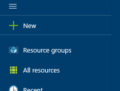
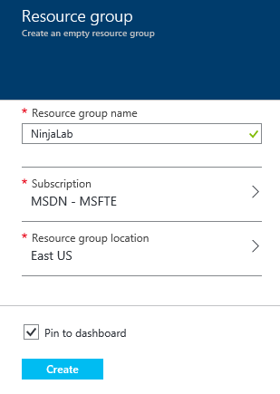
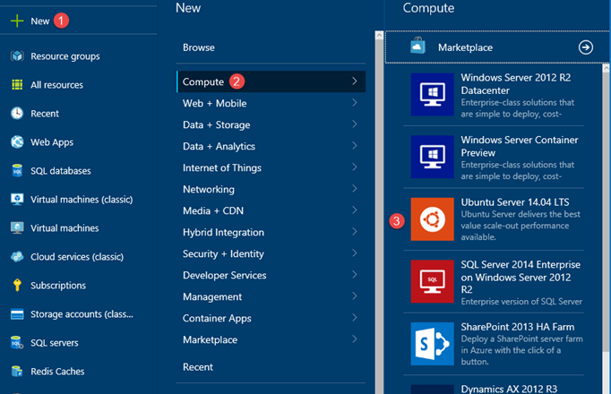
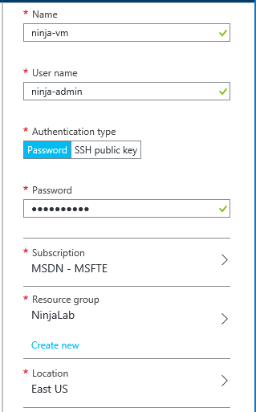
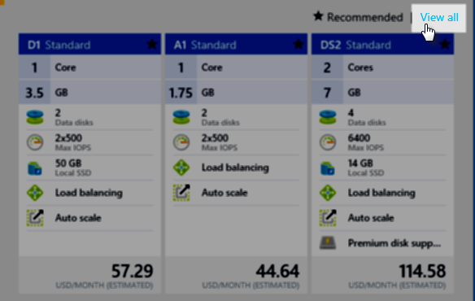

#Parte 1 - Creación de recursos 

Los titulos estan en español y los screenshos en inglés de forma intencional para poder guiar a personas con el portal configurado en cualquier de los dos idiomas

##Tarea 1 - Creación de recursos desde el desde el portal
1. Ingresa e inicia sesión en http://portal.azure.com
1. Damos click en "Grupo de Recursos"

	
1. Seguidamente damos click adicionar 

	
1. En el panel que se abre ponemos como nombre al grupo de recursos "NinjaLab", nos aseguramos de tener el checkbox habilitado y damos click en crear

	
1. Recibiermos una notificación cuando el cambio se haya aplicado

	
1. Desde el menú principal damos click en "Nuevo", "Computo" y finalmente en "Ubuntu Server" tal como se ve en la gráfica

	
1. En la parte inferior del nuevo panel abierto seleccionamos "Administrador de recursos" y damos click en "Crear"

		
1. El panel "Básico" se abre automáticamente, allí establecemos como nombre de la máquina virtual el que desees, en este caso "ninja-vm", debes utilizar otro nombre porque seguro este ya estará utilizado.
1. Ingresamos como nombre del administrador "ninja-admin" y en password aségurte de usar uno que puedas recordar.
1. Damos click en "Grupo de recursos"  y en la lista desplegada seleccionamos "Ninja-Lab"

		
1. Damos click en "Crear", luego de esto estaremos en la etapa "2 - Tamaño "
1. En el panel que se abre podemos escoger un tamaño para la máquina virtual, antes de escogerlo damos click en "Ver todo" para ver todas las opciones posibles.

		
1. De las opciones desplegadas selecionamos "A2 Standard" y damos click en el botón de la parte de abajo que dice "Seleccionar"
1.  Ahora estamos en la etapa "3 - Configuración"

	
1. Aquí podemos seleccionar el tipo de almacenamiento para la MV, la configuración de la red , el monitoreo y los grupos de disponibilidad. Sin embargo para efectos de este laboratorio las opciones por defecto funcionan de manera adecuada, así que damos click en "OK".

	
1. Ahora estamos en la etapa 4, que no es otra cosa que el resumen de las configuraciones que acabamos de hacer. Damos click en "OK"
1. En este punto los 4 item de la lista deben aparecer con un check verde, sino es así navega por ellos y acepta los cambios en cada uno.
1. Se generará una notificación indicando que se esta creando el recurso, en este caso una máquina virtual.

	
1. Este último paso tomará unos minutos, pero una vez finalice tu máquina virtual estará creada. **Puedes seguir avanzando con otras tareas del laboratorio** mientras el proceso sigue adelante.
1. Una vez termina el proceso recibiras una nueva notificación en el portal

	
1. Descarga el [PuTTY](http://the.earth.li/~sgtatham/putty/latest/x86/putty.exe) para conectarte remotamente a tu máquina virtual
1. Desde PuTTY conétate con los datos de tu MV, utiliza la dirección IP pública que aparece en el dashboard de la MV en el portal de Azure

	
1. Al aparecer la siguiente pantalla ingresa como administrador "ninja-admin" y utliza el password que estableciste previamente

	
1. Fin 

##Tarea 2 - Creación de una máquina virtual desde la línea de comandos multiplataforma
##Tarea 3 - Grupo de recursos, máquina virtual, website y base de datos desde el portal

#Parte 2 - Infraestructura como código 

##Tarea 1 - Creación del archivo de configuración
##Tarea 2 - Ejecución local del archivo de configuración
##Tarea 3 - Configuración de repositorio en la nube
##Tarea 4 - Crear solución de prueba en Visual Studio
##Tarea 5 - Integrar la infraestructura, integración continua
  