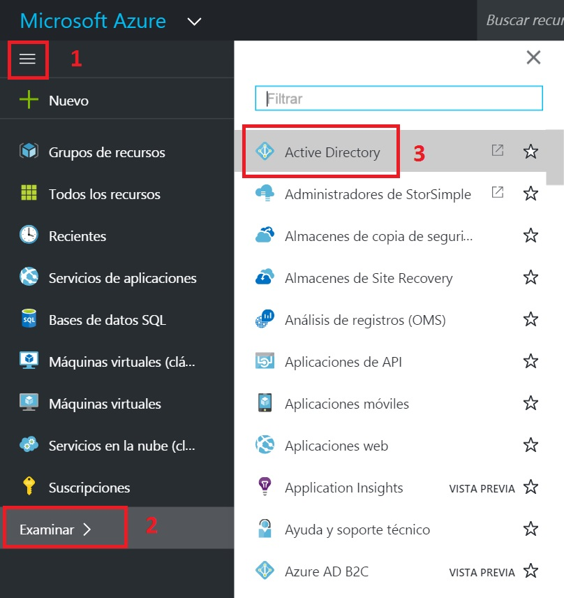
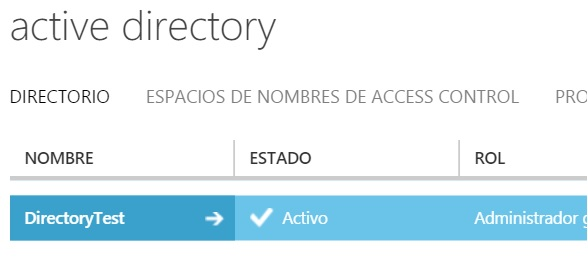
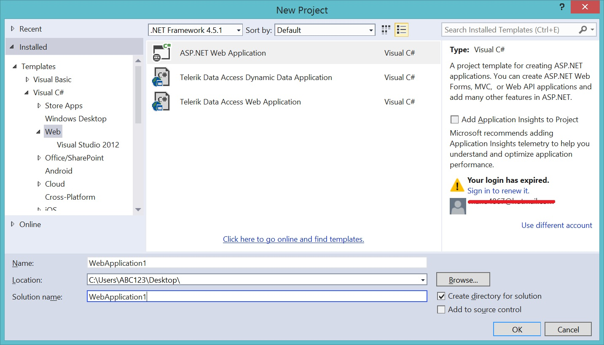
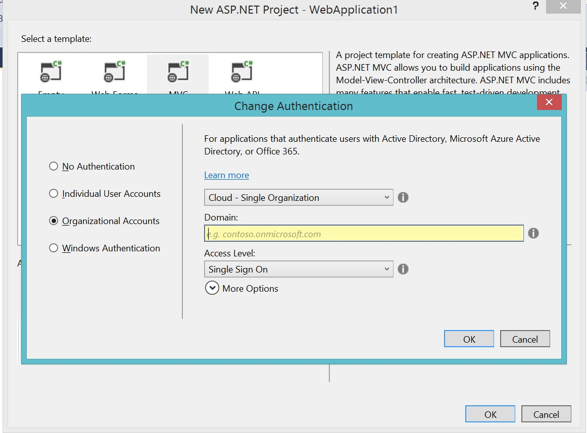


# Aplicaciones WEB ASP.NET Autenticadas contra Azure Active Directory
En este laboratorio usaremos Azure Active Directory como proveedor de autenticación y autorización (Identity Provider).

## Paso 1 - Ingresar al portal de Microsoft Azure
1. Ingresar a **http://portal.azure.net/**
1. Logearse con los datos de su suscripción.
1. Buscar el servicio de Directorio Activo.  
2. Será redirigido al portal antiguo, en caso de solicitarle usuario y contraseña ingrese los datos de su suscripción.

## Paso 2 - Conociendo el Directorio
1. En los servicios de Directorio Activo, verá un directorio por defecto.  
1. Haga click sobre ese directorio, desde allí podrá administrar los usuarios, aplicaciones y configuraciones generales del directorio.
2. Tómese su tiempo para explorar cada pestaña, es importante identificar la sección de usuarios, aplicaciones y configuración, ingrese a cada una y familiarícese con las secciones.

## Paso 3 - Cree un proyecto WEB en Visual Studio
1. Inicie Visual Studio y cree un nuevo proyecto web ASP.NET.  
2. Seleccione el tipo de proyecto MVC
3. Haga click en el botón cambiar autenticación
4. Seleccione "Cuentas Organizacionales" (El nombre podría cambiar según la versión de visual studio).  
5. En el campo Dominio ingrese el dominio asociado a su tenant de directorio activo.
6. Podrá encontrar el dominio de su tenant en la pestaña dominio del portal administrativo de azure.
7. Haga Click en aceptar.
    * Quizás se le pida usuario y contraseña, ingrese con los datos de su suscripción.
    * Este paso creara la aplicación y la registrará ante azure, ademas de preparar el proyecto con las configuraciones necesarias para autenticarse con el directorio activo de azure.
8. Corra la aplicación en modo Debug (F5).
    * Es posible que el proyecto le pregunte sobre permisos para confiar en un certificado SSL de prueba, acepte dichos permisos para que la aplicación pueda continuar.
9. Explore la aplicación, autentiquese, y cierre sesión.
    * Puede probar abriendo la aplicación en una pestaña de navegación privada para que su logeo en el portal de azure no interfiera.

## Paso 4 - Agregue usuarios a su aplicación.
1. En el portal de administración dirijase a la pestaña de usuarios.
2. En la parte inferior encontrará un botón agregar un nuevo usuario.
3. En el tipo de usuario seleccione "Nuevo usuario en la organización".
4. Ingrese un identificador unico para su nuevo usuario, notará que este termina por defecto con el dominio por defecto asignado a su directorio activo.
5. Haga click en siguiente e ingrese los datos del nuevo usuario, en el rol del usuario seleccione "Usuario".
6. Haga click en sigueinte y posteriormente click en Crear.
7. El asistente mostrará una contraseña temporal asignada al nuevo usuario.
8. Corra de nuevo la aplicación web creada en una pestaña privada del navegador e ingrese con los datos del nuevo usuario.
    * Por ser la primera vez que ingresa el sitio de autenticación le pedirá cambiar la contraseña.

## Paso 5 - Agrege roles a su aplicación.
1. En el portal administrativo de Azure, dirijase a la pestaña aplicaciones.
2. Seleccione su aplicación (Debe tener el mismo nombre que el proyecto web creado en Visual Studio).
    * Si tiene alguna dificultad encontrando su aplicación, pruebe recargando la página.
3. En la parte inferior verá el boton "Administrar Manifiesto", haga click en este boton y seleccione "Descargar manifiesto".
4. Abra dicho archivo con Visual Studio o cualquier otro editor de texto.
5. Ubique la sección "appRoles":[] que generalmente está al inicio del archivo.
6. Agregue la siguiente sección dentro del arreglo para crear un nuevo rol.

{
    "allowedMemberTypes": ["User"],
    "description": "Admins can manage roles and perform all task actions.",
    "displayName": "Admin",
    "id": "81e10148-16a8-432a-b86d-ef620c3e48ef",
    "isEnabled": true,
    "origin": "Application",
    "value": "Admin"
}

Debe repetir esta entidad json por cada rol que desee crear, se recomienda crear como mínimo dos roles (Admin, Viewer), para esto debe cambiar las siguientes propiedades: 
    * description
    * displayName
    * id (Esto es un GUID, Visual Studio tiene una utilidad para generar GUID's -Menu: Herramientas -> Create Guid.
    * value.

Al finalizar la sección appRoles debe ser similar a la siguiente:

"approles":[
   {
        "allowedMemberTypes": ["User"],
        "description": "Admins can manage roles and perform all task actions.",
        "displayName": "Admin",
        "id": "81e10148-16a8-432a-b86d-ef620c3e48ef",
        "isEnabled": true,
        "origin": "Application",
        "value": "Admin"
    }, 
    {
        "allowedMemberTypes": ["User"],
        "description": "Read only role",
        "displayName": "Viewer",
        "id": "91e10148-16a8-432a-b86d-ef620c3e48ef",
        "isEnabled": true,
        "origin": "Application",
        "value": "Viewer"
    }
]

7. Guarde el archivo y subalo al portal de azure usando el mismo botón "Administrar Manifiesto", pero esta vez seleccione la opción "Cargar Manifiesto".
8. Asigne un rol a cada usuario
    * En el portal de azure, seleccione la pestaña "Aplicaciones".
    * Ingrese a la aplicación creada anteriormente.
    * Seleccione el usuario y haga click en el boton asignar ubicado en la barra de acciones inferior del portal.
    * Seleccione el rol para dicho usuario y haga click en aceptar.

## Paso 6 - Modifique su aplicación para aceptar roles.

1. Modifique el controlador "HomeController".
2. A la acción "About" agreguele el siguiente atributo.
    * [Authorize(Roles="Admin")]
3. A la acción "Contact" agreguele el siguiente atributo.
    * [Authorize(Roles="Viewer")]
4. Corra la aplicación, pruebe cerrando sesión y autenticandose con los dos usuarios que tienen roles diferentes.
    * Intente en ambos casos ingresar a la pagina about y contact, para cada una verá si tiene o no permisos según la configuración de autorización del rol en la aplicación web.