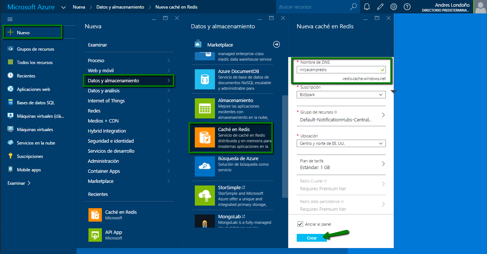
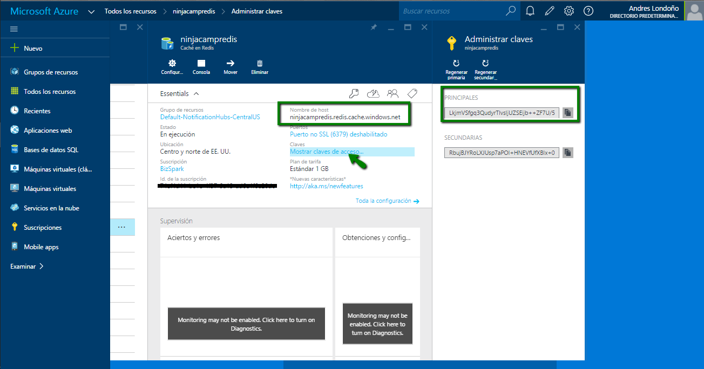
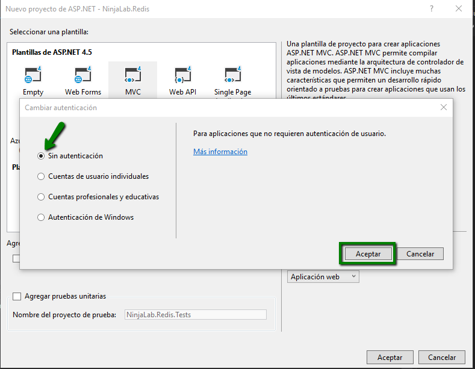

#Ninja Lab de Redis cache 

A continuación se describen los pasos correspondientes 
para realizar un aplicativo Asp.Net Mvc utilizando el servicio de Redis 
cache proporcionado por Microsoft Azure, en esta ocasión utilizando la libreria
de ServiceStack.Redis, pero recuerda que puedes implementar Redis en diferentes 
plataformas y lenguajes de programación.

###Paso 1: Creación del servicio de Redis cache en Azure
1. Ingresamos al portal de Microsoft Azure (http://portal.azure.com) y seleccionamos la opción de menu
lateral +Nuevo --> Datos y almacenamiento --> Caché en Redis
	- Posteriormente ingresamos un nombre de DNS requerido para crear nuestra cache de Redis.
	- Damos click en Guardar y esperemos su creación.

	
	
1. Ya creado nuestro servicio Redis, accedemos a él y nos mostrará el nombre de host definitivo.
	- Damos click sobre "Mostrar claves de acceso...", podremos obtener la llave necesaria para nuestra conexión. 
	- Guarda los datos del host y llave generados, pronto los necesitaremos.

	

###Paso 2: Creación de proyecto Asp.Net Mvc

1. Abrimos nuestro visual studio y procedemos a dar click en "Nuevo proyecto".
	- Abierta nuestra ventana de creación de nuevo proyecto buscamos la plantilla de C# --> Web.
	- Seleccionamos Aplicación web Asp.Net.
	- Indicamos el nombre de nuestro proyecto.
	- Damos click en "Aceptar".
	
	

1. Al crear nuestro proyecto web se abrira la ventana correspondiente para seleccionar nuestra plantilla.
	- Seleccionamos la plantilla MVC.
	- Para evitar crear todo el esquema de ejemplo de nuestro proyecto MVC que implementa Autenticación, procedemos a quitarla, damos click en "Cambiar autenticación".

	
	
1. Seleccionamos la opción de "Sin autenticación" y presionamos "Aceptar".
	- Ya de regreso en la ventana de la plantilla, volvemos a presionar "Aceptar"

	

###Paso 3: Instalación de librerias necesarias (Redis, Entity Framework)

1. Creado nuestro proyecto, presionamos click derecho sobre References y seleccionamos "Administrar paquetes Nuget..."
	- En el cuadro de busqueda ingresamo "Redis"
	- Seleccionamos "ServiceStack.Redis".
	- Presionamos "Instalar" y posterior aceptamos la licencia de esta libreria.
	
	
1. Permanecemos en la ventana de administración de paquetes de nuget
	- En el cuadro de busqueda ingresamo "Entity"
	- Seleccionamos "EntityFramework".
	- Presionamos "Instalar" y posterior aceptamos la licencia de esta libreria.
	
	
	
###Paso 4: Creación de Modelo para demo

1. En la carpeta Models presionamos click derecho y vamos Agregar --> Clase...
	- La clase a crear la llamaremos "Event.cs"
	- Importamos las librerias necesarias para crear nuestra propiedad de identificación.
	- Creamos las diferentes propiedades requeridas para nuestro demo.
	
	 

