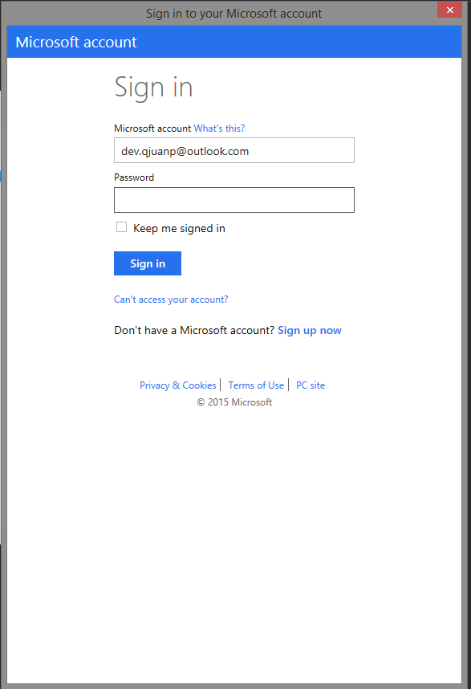
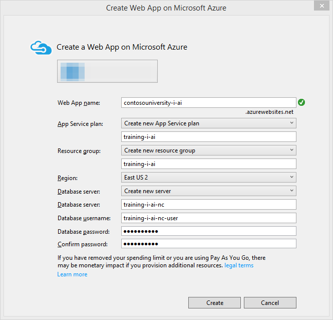
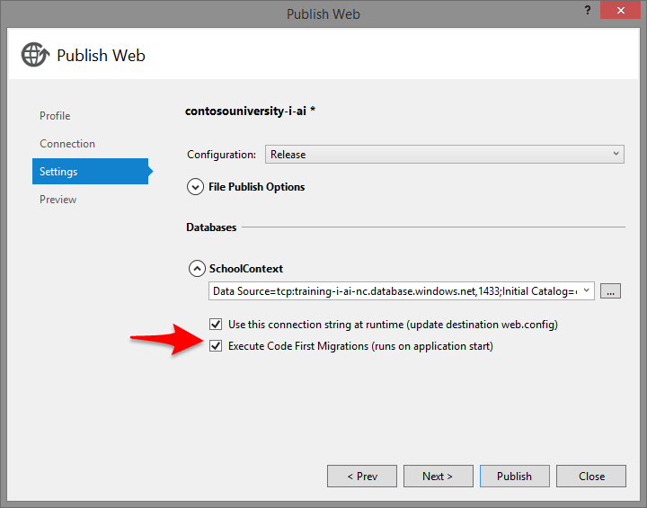
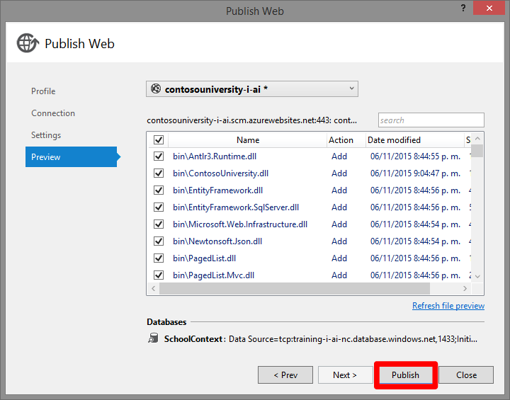

#Application Insights

##Qué vamos a hacer?
En este laboratorio veremos como usar Azure Application Insights para el monitoreo de una aplicación en la detección de fallos y problemas de performance.

##Cómo lo vamos a hacer?
Para esto, integraremos Application Insights a diferentes aplicaciones a las que hemos introducido fallas puntuales, el objetivo al finalizar este laboratorio es poder detectar las fallas y poder darles solución.

> El reto: Vamos a simular que las aplicaciones se encuentran en producción y verificaremos su comportamiento en ejecución sin revisar el código.

##Pre-requisitos
* Una suscripción activa a Azure
* Visual Studio 2015
* Visual Studio Code (Opcional)

##Objetivos
- [ ] Identificar problemas de desempeño sobre la aplicación ContosoUniversity
- [ ] Identificar los fallos de la aplicación ContosoUniversity
- [ ] Objetivo 3
- [ ] Objetivo 4

##Treas
- [Tarea 1 - Descargar la aplicación de ejemplo y publiquela en un WebSite de Azure](#tarea-1)
- [Tarea 2](#tarea-2)
- [Tarea 3](#tarea-3)
- [Tarea 4](#tarea-4)
- [Tarea 5](#tarea-5)
- [Tarea 6](#tarea-6)
- [Tarea 7](#tarea-7)
- [Tarea 8](#tarea-8)

###Tarea 1
####Descargar la aplicación ContosoUniversity
Diríjase al directorio "aplicaciones" de este repositorio y copie la aplicación [ContosoUniversity](./aplicaciones/ContosoUniversity/) en su directorio de trabajo.

Abra la aplicación desde Visual Studio 2015.

Compile la aplicación y verifíque que la compilación este correcta antes de realizar el paso de publicación.

####Publicar la aplicación en Azure
Realize la publicación de la aplicación ContosoUniversity a su cuenta en Azure desde Visual Studio 2015

Cree un nuevo perfil de publicación para Web Apps

Recuerde que debe iniciar sesión con la cuenta que tenga asociada para acceder a su subscripción de Windows Azure

Defina para la publicación de su Web App
- El **Service Plan** al que va a pertenecer la Web App (Plan Free por defecto)
- El **Resource Group** que va a contener la Web App
- La **Región de Azure** en donde se van a publicar la Web App
- Crear una nueva **Base de Datos** para los datos de la aplicación ContosoUniversity

Active la migración para que se puedan desplegar los datos de la base de datos de ContosoUniversity

Y Publique la Web App

Verifique las diferentes secciones de la aplicación e ingrese datos adicionales en cada una de ellas
- Instructores
- Departamentos
- Clases
- Estudiantes
- Acerca de
- etc...

**¿Qué sucedio con la aplicación en este punto en este punto?**
La aplicación tiene algunos problemas de performance y errores dificilmente visibles

###Tarea 3
####

###Tarea 4

###Tarea 5

###Tarea 6

###Tarea 7

###Tarea 8

