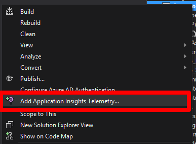
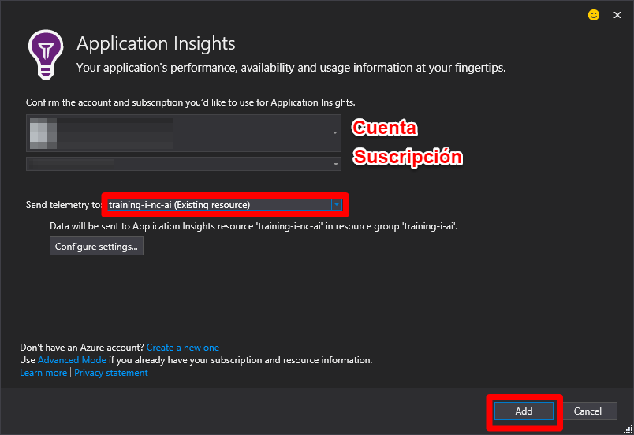

#Application Insights

##Qué vamos a hacer?
En este laboratorio veremos como usar Azure Application Insights para el monitoreo de una aplicación en la detección de fallos y problemas de performance.

##Cómo lo vamos a hacer?
Para esto, integraremos Application Insights a una aplicación a la cual le hemos introducido fallas puntuales, el objetivo al finalizar este laboratorio es poder detectar las fallas y poder darles solución.

> El reto: Vamos a simular que la aplicacion se encuentran en producción y verificaremos su comportamiento en ejecución sin revisar el código.

##Pre-requisitos
* Una suscripción activa a Azure
* Visual Studio 2015
* Visual Studio Code (Opcional)

##Objetivos
- [ ] Identificar problemas de desempeño sobre la aplicación ContosoUniversity
- [ ] Identificar los fallos de la aplicación ContosoUniversity
- [ ] Interactuar con el tablero de Application Insights
- [ ] Conocer las herramientas que ofrece Applications Insights

##Treas
- [Tarea 1 - Descargar la aplicación de ejemplo y publiquela en un WebSite de Azure](#tarea-1)
- [Tarea 2 - Integrar Application Insights](#tarea-2)
- [Tarea 3 - Agregar información de excepciones a Application Insights](#tarea-3)
- [Tarea 4 - Registrar información de Trazas en Application Insights](#tarea-4)

###Tarea 1
####Descargar la aplicación ContosoUniversity
Diríjase al directorio "aplicaciones" de este repositorio y copie la aplicación [ContosoUniversity](./aplicaciones/ContosoUniversity/) en su directorio de trabajo.

Abra la aplicación desde Visual Studio 2015.


Compile la aplicación y verifíque que la compilación este correcta antes de realizar el paso de publicación.


####Publicar la aplicación en Azure
Realize la publicación de la aplicación ContosoUniversity a su cuenta en Azure desde Visual Studio 2015


Cree un nuevo perfil de publicación para Web Apps


Recuerde que debe iniciar sesión con la cuenta que tenga asociada para acceder a su subscripción de Windows Azure


Defina para la publicación de su Web App
- El **Service Plan** al que va a pertenecer la Web App (Plan Free por defecto)
- El **Resource Group** que va a contener la Web App
- La **Región de Azure** en donde se van a publicar la Web App
- Crear una nueva **Base de Datos** para los datos de la aplicación ContosoUniversity


Active la migración para que se puedan desplegar los datos de la base de datos de ContosoUniversity


Y Publique la Web App


Verifique las diferentes secciones de la aplicación e ingrese datos adicionales en cada una de ellas
- Instructores
- Departamentos
- Clases
- Estudiantes
- Acerca de
- etc...


#####**¿Qué sucedio con la aplicación en este punto en este punto?**
La aplicación tiene algunos problemas de performance y errores dificilmente visibles

###Tarea 2
####Integrar Application Insights
Primero, vamos a crear nuestro Application Insight desde el [Portal de Azure](https://portal.azure.com)

Primero ubique la sección de servicios de Application Insights 


Cree un nuevo Application Insights


Defina los parámetros necesarios para el Application Insights


Ahora desde Visual Studio 2015 vamos a integrar nuestra aplicación con Application Insights
Desde el proyecto principal, click derecho -> Add Application Insights Telemetry...



Luego, despues de seleccionar la cuenta y la subscripción en la que se encuentra definido nuestro Application Insight, seleccionamos el que habiamos creado previamente, y le damos agregar.



Despues de publicar de nuevo la aplicación, vamos a navegar de nuevo por donde habiamos detectado en la [Tarea 1](#tarea-1) los errores y problemas de performance para comenzar a recopilar datos con Application Insigths.

#####**¿Qué información nos arroja Application Insight sobre ContosoUniversity?**
¿En donde se encuentran los problemas de performance?
¿En donde se reportan errores 500?
¿Nos hace falta información?

###Tarea 3
####Agregar información de excepciones a Application Insights
Para integrarlo facilmente a MVC5 creamos el siguiente filtro en nuestro código

```C#
using System;
using System.Web.Mvc;
using Microsoft.ApplicationInsights;

namespace ContosoUniversity.Common
{
    [AttributeUsage(AttributeTargets.Class | AttributeTargets.Method, Inherited = true, AllowMultiple = true)]
    public class AiHandleErrorAttribute : HandleErrorAttribute
    {
        public override void OnException(ExceptionContext filterContext)
        {
            if (filterContext != null && filterContext.HttpContext != null && filterContext.Exception != null)
            {
                //If customError is Off, then AI HTTPModule will report the exception
                if (filterContext.HttpContext.IsCustomErrorEnabled)
                {
                    // Note: A single instance of telemetry client is sufficient to track multiple telemetry items.
                    var ai = new TelemetryClient();
                    ai.TrackException(filterContext.Exception);
                }
            }
            base.OnException(filterContext);
        }
    }
}
```

Y registramos el filtro de manera global en el `FilterConfig` de nuestro código

```C#
// ...
public static void RegisterGlobalFilters(GlobalFilterCollection filters)
{
    filters.Add(new AiHandleErrorAttribute());
}
// ...
```

Y publicamos de nuevo nuestra aplicación

#####**¿Qué información nos arroja Application Insight sobre ContosoUniversity?**
¿Cuales son las excepciones que se estan presentando?

###Tarea 4
####Registrar información de Trazas en Application Insights
Para este paso necesitaremos instalar el siguiente paquete [Application Insights TraceListener](https://www.nuget.org/packages/Microsoft.ApplicationInsights.TraceListener/1.0.0)

`PM> Install-Package Microsoft.ApplicationInsights.TraceListener -Version 1.0.0`

Luego... simplemente desplegar.

#####**¿Qué información nos arroja Application Insight sobre ContosoUniversity?**
¿Cuales información se está registrando en las trazas?

###Tarea 5
####Conteo de eventos
Podemos urilizar Application Insigths para medir eventos especificos dentro de nuestra aplicación.
Algo como los nuevos estudiantes e instructores que se registran pueden verse con una metrica en el tablero de Application Insigths

Contar cuantos estudiantes se registran en la aplicación
En la clase Controllers\StudentController.cs agergar al metodo Crear (POST):

```C#
public ActionResult Create([Bind(Include = "LastName, FirstMidName, EnrollmentDate")]Student student)
{
    // .. 
        if (ModelState.IsValid)
        {
            db.Students.Add(student);
            db.SaveChanges();
            
            //----------------------------------------------
            TelemetryClient telemetry = new TelemetryClient();
            telemetry.TrackEvent("NewStudent");
            //----------------------------------------------
            
            return RedirectToAction("Index");
        }
    //..
}
```


Contar cuantos instructores se reginstran en la aplicación
En la clase Controllers\InstructorController.cs agergar al metodo Crear (POST):

```C#
public ActionResult Create([Bind(Include = "LastName,FirstMidName,HireDate,OfficeAssignment")]Instructor instructor, string[] selectedCourses)
{
    //..
    if (ModelState.IsValid)
    {
        db.Instructors.Add(instructor);
        db.SaveChanges();

        //----------------------------------------------
        TelemetryClient telemetry = new TelemetryClient();
        telemetry.TrackEvent("NewInstructor");
        //----------------------------------------------

        return RedirectToAction("Index");
    }
    //..
}
```

#####**¿Qué información nos arroja Application Insight sobre ContosoUniversity?**
¿Cuantos usuarios hemos podido crear en nuestra aplicación?
