**<span style="font-variant:small-caps;">Iniciando con los
concentradores de eventos -</span>** **<span
style="font-variant:small-caps;">Event Hub</span>**

**Introducción**
----------------

Un concentrador de eventos es un servicio que procesa grandes cantidades
de datos de eventos de dispositivos y aplicaciones conectadas. Después
de recopilar datos en un concentrador de eventos, puede almacenar los
datos utilizando un clúster de almacenamiento o transformarlo mediante
un proveedor de análisis en tiempo real. Esta capacidad de recolección y
procesamiento de eventos a gran escala es un componente clave de las
arquitecturas de aplicaciones modernas, como el Internet de las Cosas
(IoT).

Este tutorial muestra cómo utilizar el portal de Azure para crear un
Event Hub. También muestra cómo recolectar mensajes en un centro de
eventos mediante una aplicación de consola escrito en C \#, y cómo
recuperar en paralelo usando la biblioteca del [*Procesador de
eventos*](https://www.nuget.org/packages/Microsoft.Azure.ServiceBus.EventProcessorHost).

Para completar este tutorial, necesitará lo siguiente:

Microsoft Visual Studio 2013 o Microsoft Visual Studio Express 2013 para
Windows.

Una cuenta Azure activa.

Si usted no tiene una cuenta, puede crear una cuenta de prueba gratuita
en sólo un par de minutos. Para obtener más información, consulte *Azure
Free Trial*.

**Crear un Event Hub**
----------------------

1.  Inicie sesión en el [*portal de administración
    de* ](https://manage.windowsazure.com/)Azure, y haga clic
    en **NUEVO** en la parte inferior de la pantalla.

2.  Haga clic en **App Services**, luego en **Service
    Bus,** **Event** **Hub**, y a continuación, **Quick Create**. 

    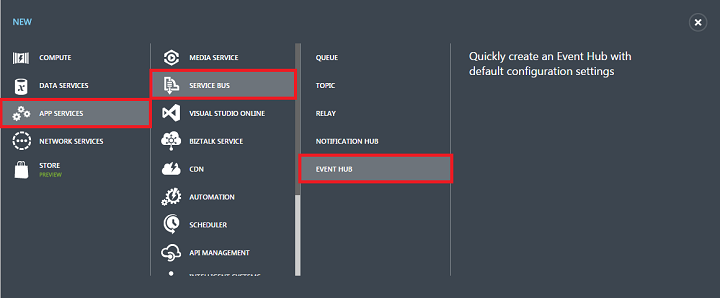

3.  Escriba un nombre para su concentrador de eventos, seleccione la
    región que desee y a continuación, haga clic en **Create a new Event
    Hub**.

    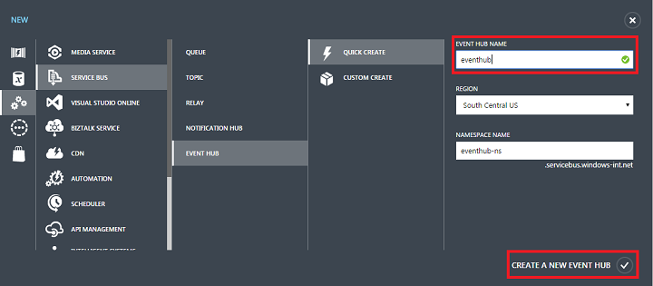
4.  Haga clic en el espacio de nombres que acaba de crear
    (generalmente ***event hub name*-ns**).

    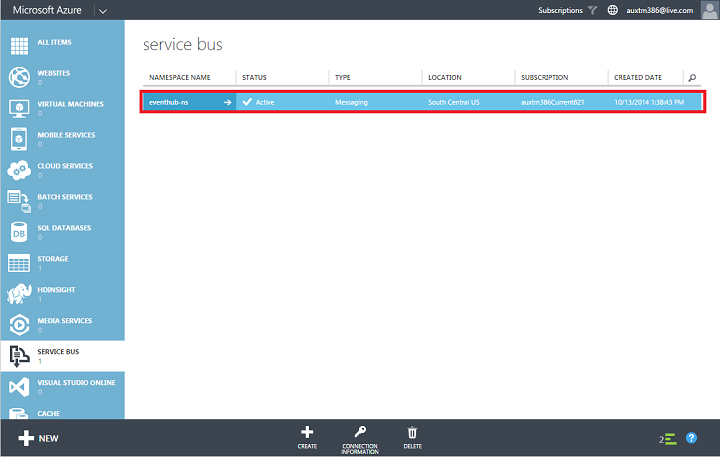

5.  Haga clic en la pestaña **Event Hubs** en la parte superior de la
    página y, a continuación, haga clic en el concentrador de eventos
    que acaba de crear.

    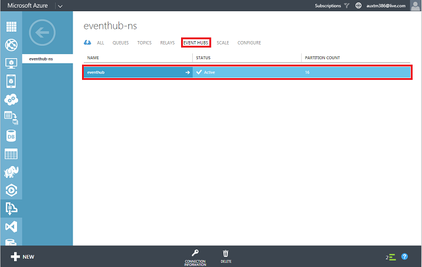

6.  Haga clic en la pestaña **Configure**  en la parte superior, agregue
    una regla denominada **SendRule** con *permisos para enviar (Send)*,
    y agregue otra regla llamada **ReceiveRule** con permisos para
    *Manage, Send, Listen.* Haga clic en **Save**.

    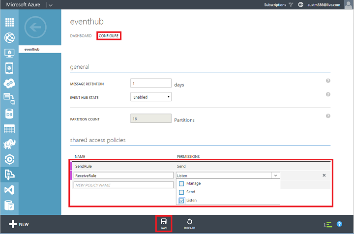

7.  Haga clic en la pestaña **Dashboard**  en la parte superior de la
    página y a continuación en **Connection Information**. Tome nota de
    las dos cadenas de conexión o cópielos en algún lugar para
    utilizarlos más adelante en este tutorial.

    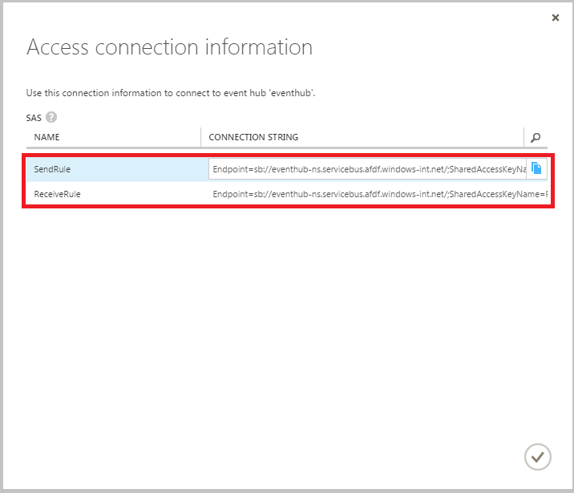

En este punto ya está creado el Hub de eventos y tenemos las cadenas de
conexión que necesitamos para enviar y recibir eventos.

**Enviar mensajes a los Hubs de eventos**
-----------------------------------------

En esta sección, vamos a escribir una aplicación de consola de Windows
que envíe eventos a su Hub de eventos.

1.  En Visual Studio, cree un nuevo proyecto de Visual C \# aplicación
    de escritorio utilizando la plantilla de proyecto de **aplicación de
    consola**. Nombre el proyecto como **Sender**.

    

2.  En el Explorador de soluciones, haga clic en la solución y, a
    continuación, haga clic en **Manage NuGet Packages for Solution**

Esto muestra el cuadro de diálogo Administrar Paquetes NuGet.

3.  Búsqueda de Microsoft Azure Service Bus, haga clic en** Install**, y
    acepte los términos de uso.

    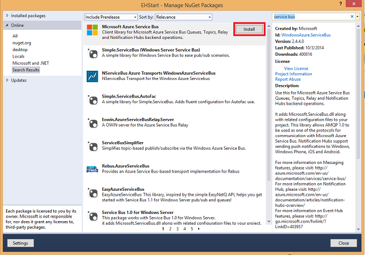

Esto descarga, instala, y añade una referencia a la [*biblioteca de
Azure Service Bus
paquete* ](https://www.nuget.org/packages/WindowsAzure.ServiceBus/)NuGet.

1.  Agregue las siguientes declaraciones de librerias en la parte
    superior del archivo **Program.cs**:

    using System.Threading;
    
    using Microsoft.ServiceBus.Messaging;

1.  Agregue los siguientes campos a la clase **Program**, sustituyendo
    los valores con el del Event Hub que ha creado en el apartado
    anterior, y la cadena de conexión con permisos de **Send**:

    static string eventHubName = "{event hub name}";
    
    static string connectionString = "{send connection string}";

1.  Agregue el siguiente método para la clase **Program**:
    
    ```
    static void SendingRandomMessages()
    {
        var eventHubClient = EventHubClient.CreateFromConnectionString(connectionString, eventHubName);
        while (true)
        {
            try
            {
                var message = Guid.NewGuid().ToString();
                Console.WriteLine("{0} > Sending message: {1}", DateTime.Now, message);
                eventHubClient.Send(new EventData(Encoding.UTF8.GetBytes(message)));
            }
            catch (Exception exception)
            {
                Console.ForegroundColor = ConsoleColor.Red;
                Console.WriteLine("{0} > Exception: {1}", DateTime.Now,exception.Message);
                Console.ResetColor();
            }
        Thread.Sleep(200);
        }
    }
    ```
Este método envía continuamente eventos a su Hub de eventos con un
retraso de 200ms.

1.  Por último, añadir las siguientes líneas al método Main:
    ``` 
    Console.WriteLine("Press Ctrl-C to stop the
    sender process");
    Console.WriteLine("Press Enter to start now");
    Console.ReadLine();
    SendingRandomMessages();
    **Recibir mensajes con EventProcessorHost**
    ```

[*EventProcessorHost*](http://msdn.microsoft.com/library/azure/microsoft.servicebus.messaging.eventprocessorhost(v=azure.95).aspx) es
una clase .NET que simplifica la recepción de eventos de concentradores
de eventos mediante la gestión de los puestos de control persistentes y
paralelamente recibe de los Event Hubs. Usando *EventProcessorHost,*
puede dividir los eventos a través de múltiples receptores, incluso
cuando estén hospedados en diferentes nodos. Este ejemplo muestra cómo
utilizar *EventProcessorHost* para un solo receptor. El  ejemplo del
procesamiento de eventos escalado (*Scaled out event processing*)
muestra cómo
utilizar [*EventProcessorHost*](http://msdn.microsoft.com/library/azure/microsoft.servicebus.messaging.eventprocessorhost(v=azure.95).aspx) con
múltiples receptores.

Para utilizar *EventProcessorHost*, debes tener una [cuenta de
Azure ](https://azure.microsoft.com/en-us/documentation/articles/storage-create-storage-account/)Storage:

1.  Inicie sesión en el [*portal
    de *](http://manage.windowsazure.com/)*Azure,* y haga clic
    en **NUEVO** en la parte inferior de la pantalla.

2.  Haga click en **Data Services**, a continuación en **Storage,** y
    luego **Quick Create**, a continuación, escriba un nombre para su
    cuenta de almacenamiento. Seleccione la región que desee y a
    continuación, haga clic en **Create Storage Account**.

    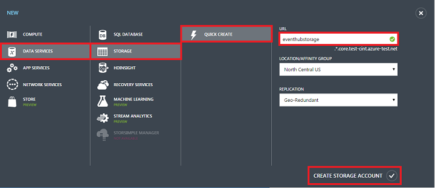

3.  Haga clic en la nueva cuenta de almacenamiento y a continuación,
    haga clic en **Manage Access Keys**:

    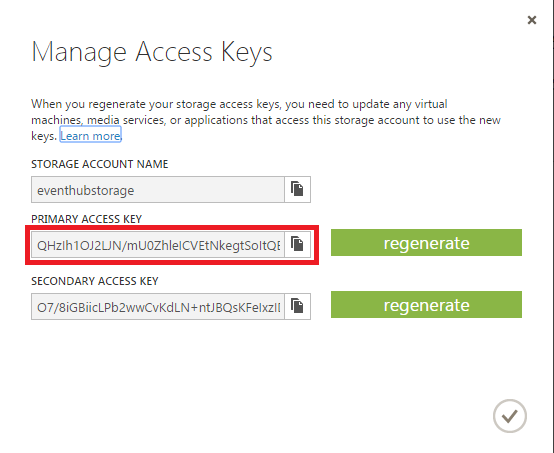

Copie la clave de acceso para utilizar más adelante en este tutorial.

1.  En Visual Studio, cree un nuevo proyecto de Visual C\# aplicación de
    consola utilizando la plantilla de proyecto **Console
    Application**. Nombre  el proyecto como **Receiver**.

    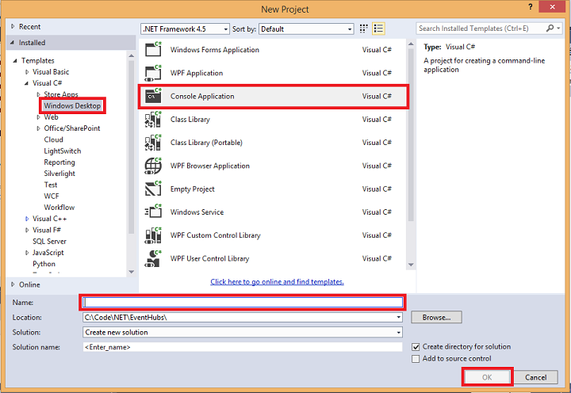

2.  En el Explorador de soluciones, haga clic en la solución y a
    continuación, haga clic en Administrar paquetes** **NuGet**.**

    **Manage NuGet Packages** mostrara el cuadro de diálogo.

3.  Busque  Microsoft Azure Service Bus Event Hub -
    EventProcessorHost, haga clic en** **Instalar, y acepte los términos
    de uso.

    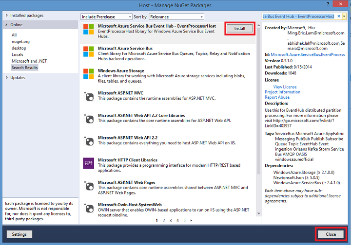

Esto descarga e instala y añade una referencia al [servicio Azure
autobús Evento Hub - paquete
EventProcessorHost ](https://www.nuget.org/packages/Microsoft.Azure.ServiceBus.EventProcessorHost)NuGet, con
todas sus dependencias.

1.  Haga clic derecho en el proyecto **Receiver**, haga clic
    en **Agregar** y a continuación, haga clic en **Class**. Nombre de
    la nueva clase **SimpleEventProcessor** y a continuación, haga clic
    en **Aceptar** para crear la clase.

2.  Agregue las siguientes instrucciones en la parte superior del
    archivo *SimpleEventProcessor.cs:*
    ```
    using Microsoft.ServiceBus.Messaging;
    using System.Diagnostics;
    using System.Threading.Tasks;
    ```
A continuación, sustituya el siguiente código para el cuerpo de la
clase::
    ```
    class SimpleEventProcessor : IEventProcessor
    {
        Stopwatch checkpointStopWatch;
        async Task IEventProcessor.CloseAsync(PartitionContext context, CloseReason reason)
        {
            Console.WriteLine("Processor Shutting Down. Partition '{0}', Reason:
                                            '{1}'.", context.Lease.PartitionId, reason);
            if (reason == CloseReason.Shutdown)
            {
                await context.CheckpointAsync();
            }
        }
    
        Task IEventProcessor.OpenAsync(PartitionContext context)
        {
            Console.WriteLine("SimpleEventProcessor initialized. Partition: '{0}',
                        Offset: '{1}'", context.Lease.PartitionId, context.Lease.Offset);
            this.checkpointStopWatch = new Stopwatch();
            this.checkpointStopWatch.Start();
            return Task.FromResult&lt;object&gt;(null);
        }
    
        async Task IEventProcessor.ProcessEventsAsync(PartitionContext context,
                    IEnumerable&lt;EventData&gt; messages)
        {
            foreach (EventData eventData in messages)
            {
            string data = Encoding.UTF8.GetString(eventData.GetBytes());
            Console.WriteLine(string.Format("Message received. Partition: '{0}',
            Data: '{1}'",
            context.Lease.PartitionId, data));
            }
    
            //Call checkpoint every 5 minutes, so that worker can resume processing
            //from the 5 minutes back if it restarts.
            if (this.checkpointStopWatch.Elapsed &gt; TimeSpan.FromMinutes(5))
            {
                await context.CheckpointAsync();
                this.checkpointStopWatch.Restart();
            }
        }
    }
    ```
    
Esta clase será llamado por el **EventProcessorHost** para procesar
eventos recibidos desde el Hub de eventos. Tenga en cuenta que la clase
SimpleEventProcessor utiliza un cronómetro para llamar periódicamente el
método del puesto de control **EventProcessorHost**. Esto asegura que,
si el receptor se reinicia, no perderá más de cinco minutos de trabajo
de procesamiento.

1.  En la clase **Program** , agregue las siguientes declaraciones
    using  en la parte superior:

    ```
    using Microsoft.ServiceBus.Messaging;
    using Microsoft.Threading;
    using System.Threading.Tasks;
    ```
    
A continuación, modifique el método **Main**  para la clase **Program** 
como se muestra a continuación, sustituyendo el nombre y la conexión de
la cadena de eventos Hub y la cuenta de almacenamiento y clave que ha
copiado en los apartados anteriores:
    
    ```
    static void Main(string\[\] args)
    {
        string eventHubConnectionString = "{event hub connection string}";
        string eventHubName = "{event hub name}";
        string storageAccountName = "{storage account name}";
        string storageAccountKey = "{storage account key}";
        string storageConnectionString =
        string.Format("DefaultEndpointsProtocol=https;AccountName={0};AccountKey={1}",
                            storageAccountName, storageAccountKey);
        string eventProcessorHostName = Guid.NewGuid().ToString();
        EventProcessorHost eventProcessorHost = new
        EventProcessorHost(eventProcessorHostName, eventHubName,
                                EventHubConsumerGroup.DefaultGroupName, eventHubConnectionString,
                                storageConnectionString);
    
        Console.WriteLine("Registering EventProcessor...");
        eventProcessorHost.RegisterEventProcessorAsync<SimpleEventProcessor>().Wait();
        Console.WriteLine("Receiving. Press enter key to stop worker.");
        Console.ReadLine();
        eventProcessorHost.UnregisterEventProcessorAsync().Wait();
    }
    ```
    
##### *NOTA:*

*Este tutorial usa una sola instancia de EventProcessorHost. Para
aumentar el rendimiento, se recomienda que ejecute varias instancias
de EventProcessorHost, como se muestra en el *[*procesamiento de eventos
escalado a
cabo*](https://code.msdn.microsoft.com/windowsazure/Service-Bus-Event-Hub-45f43fc3)* la
muestra. En esos casos, las diversas instancias de coordenadas
automáticamente entre sí con el fin de equilibrar la carga de los
eventos recibidos. Si quieres varios receptores a cada proceso
de todos los eventos, debe utilizar el ConsumerGroup concepto. Al
recibir eventos de diferentes máquinas, podría ser útil para especificar
nombres para EventProcessorHost casos sobre la base de las máquinas (o
roles) en el que se despliegan. Para obtener más información sobre estos
temas, consulte los temas de  *[**Evento Hubs
general**](https://azure.microsoft.com/en-us/documentation/articles/event-hubs-overview/)* y *[**eventos
Hubs Guía de
Programación**](https://azure.microsoft.com/en-us/documentation/articles/event-hubs-programming-guide/)* .*

**Ejecute las aplicaciones**
----------------------------

Ahora ya está listo para ejecutar las aplicaciones.

1.  Desde dentro de Visual Studio, ejecute el proyecto **Receiver**, y
    luego espere a que se inicien los receptores para todas
    las particiones.

    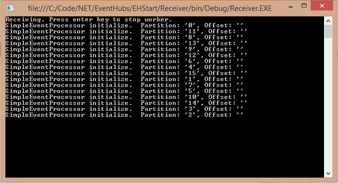

2.  Ejecute el proyecto **Sender**, pulse **Enter** en la ventana de la
    consola, y vea los eventos que aparecen en la ventana del receptor.

    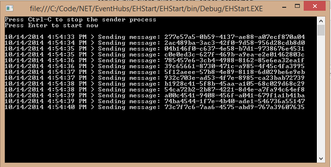
