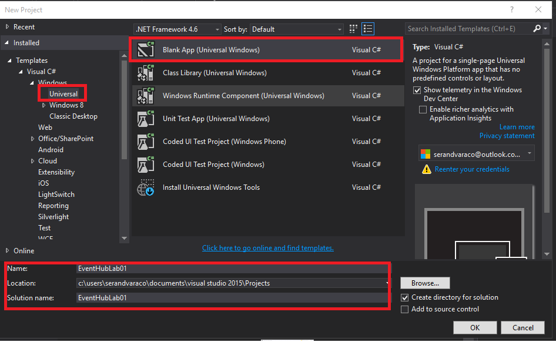
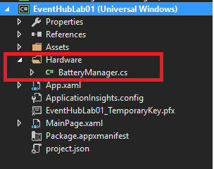
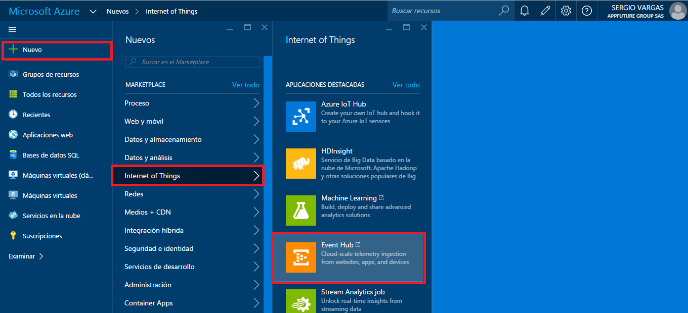
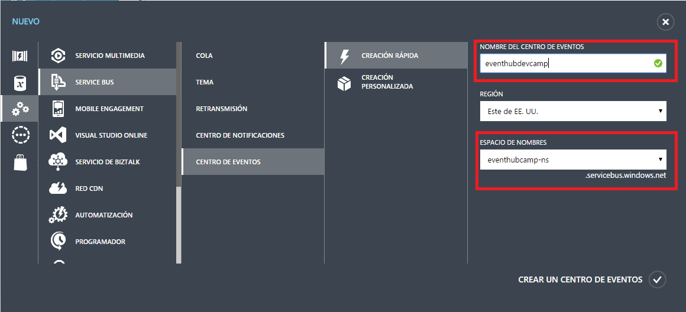
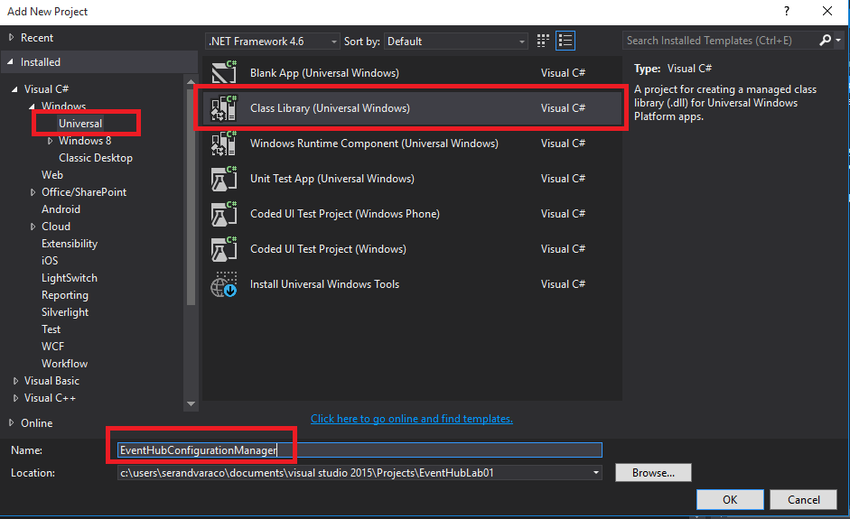
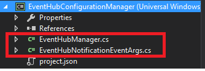
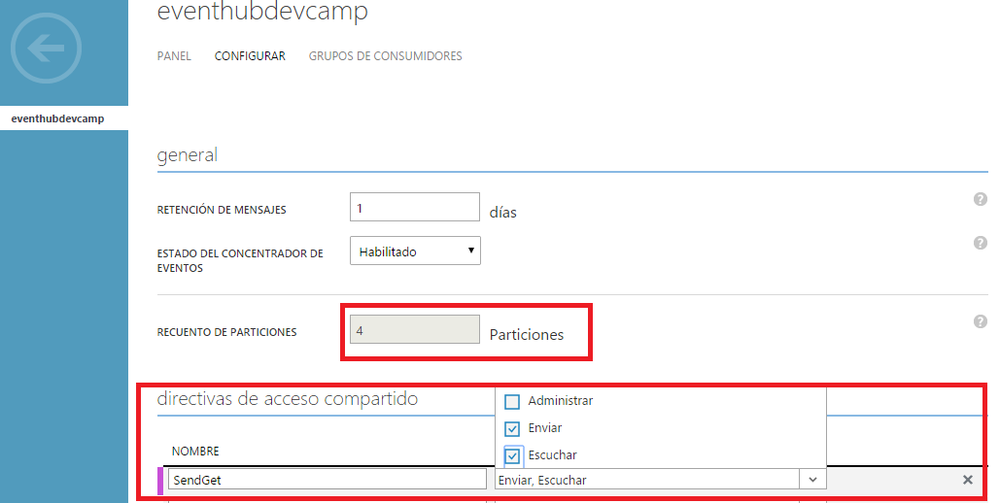
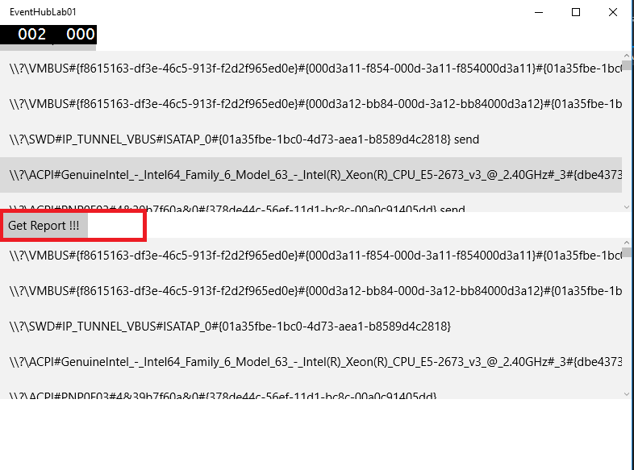

#Usar telemetría en la nube desde aplicaciones o dispositivos

<p> Microsoft nos provee una característica en su abanico de soluciones en la nube. Donde nos permite registrar millones de eventos por segundo en tiempo real, con ello poder conectar dispositivos con autorización y limitación flexibles. </p>
<p>
El mundo conectado del presente se define por los Big Data. Dichos datos proceden de diversos orígenes, como coches y termostatos conectados que generan datos de telemetría cada pocos minutos, contadores de rendimiento de aplicaciones que generan eventos cada segundo o aplicaciones móviles que capturan datos de telemetría por cada acción individual de los usuarios. En este mundo interconectado, necesita un servicio de introducción de eventos administrado con opciones flexibles de escalado a fin de dar cabida a perfiles de carga variable y a los picos causados por la conectividad intermitente.
</p><p>
La rápida proliferación de dispositivos conectados plantea retos debido a la variedad de plataformas y protocolos existentes. Conectar estas diferentes fuentes de datos controlando al mismo tiempo la escala de la secuencia agregada supone un importante desafío. Los Centros de eventos ofrecen un sencillo aprovisionamiento de la capacidad para procesar eventos procedentes de millones de dispositivos manteniendo el orden de los eventos en cada uno de los dispositivos. Gracias a la compatibilidad con AMQP y HTTP, los concentradores de eventos se pueden usar con una gran cantidad de plataformas. Además, también existen bibliotecas de cliente nativas para las plataformas más populares.</p>

##Objetivo del laboratorio
1. En este laboratorio usaremos la telemetría enviando información de nuestros dispositivos a un EventHub previo configurado  de Microsoft Azure.
1. Conoceremos el uso del protocolo AMQP para enviar y recibir notificaciones. 


##Requisitos 

los requisitos de este laboratorio son los siguientes. 

1. Visual Studio 2015: se construira una aplicación universal de Windows 10
1. una cuenta de Azure Activa ( si no tiene una puede acceder a una gratis <b>Azure Free Trial</b> )

##Manos a la obra

Sin más detalles procedemos con los siguientes pasos.

1. Lo primero que debemos crear es un proyecto nuevo en VS 2015. Seleccionando la plantilla <b>Blank App</b> y agregándole el nombre <b>EventHubLab01</b>

	

1. lo siguiente a realizar es construir una carpeta llamada <b>Hardware</b> donde contiene una clase denominada <b>BatteryManager</b> que mostrara el estado de batería del dispositivo

	


##TAREA 1:  Creando una App Universal con Windows 10

1. En esta etapa vamos incluir la fuente necesaria para acceder a los recursos del dispositivo. Le daremos doble clic al nuestro <b>MainPage.xaml</b> e incluiremos la siguiente presentación gráfica entre el  control `<grid />` 

	```xaml
	<StackPanel HorizontalAlignment="Stretch" VerticalAlignment="Stretch">
		<Button Click="sendReport_click">Send Report !!!</Button>
		<ListBox x:Name="lstDevices" Height="200"></ListBox>
		<Button Click="getReport_Click">Get Report !!!</Button>
		<ListBox x:Name="lstResponses" Height="200"></ListBox>
	</StackPanel>
			
	```
1. lo siguiente es Acceder a la clase <b>BatteryManager</b> y incluir el espacio de nombre  `Windows.Devices.Power` el cuál contiene la información de la batería del dispositivo. 

	```csharp
	using Windows.Devices.Power;
	```

1. y la inicializamos de la siguiente manera. 

	```csharp
	/// <summary>
	/// Recibe la información del hardware del dispositivo 
	/// </summary>
	private Battery _battery = Battery.AggregateBattery;

	/// <summary>
	/// Carga el estado de la bateria 
	/// </summary>
	public BatteryReport State
	{
		get
		{
			//Accede al reporte de la bateria
			return _battery.GetReport();
		}

	}

	//TODO: Extender aquí a libertad
	```

1. el fuente completo de la clase debería presentar la siguiente forma 
	```csharp
	using Windows.Devices.Power;
	
	namespace EventHubLab01.Hardware
	{
		/// <summary>
		/// Accede a la configuración de la bateria del dispositivo 
		/// </summary>
		class BatteryManager
		{
			/// <summary>
			/// Recibe la información del hardware del dispositivo 
			/// </summary>
			private Battery _battery = Battery.AggregateBattery;
	
			/// <summary>
			/// Carga el estado de la bateria 
			/// </summary>
			public BatteryReport State
			{
				get
				{
					//Accede al reporte de la bateria
					return _battery.GetReport();
				}
	
			}
	
			//TODO: Extender aquí a libertad
	
		}
	}
		
	```	
##TAREA 2: Creando un EventHub en Azure 

Para construir un <b>EventHub</b> debemos ir al [portal de azure](http://azure.microsoft.com) y crearlo de esta manera. 





Al construirlo tendremos el siguiente servicio activo 


#TAREA 3: Preparando para enviar al EventHub  

Añadiremos un proyecto a la solución de tipo <b>Class Library</b> de esta forma 



posterior a la creación incluiremos dos clases de esta forma.  



nos ubicaremos en la clase `EventHubNotificationEventArgs` e incrustaremos las siguientes líneas que nos van a permitir controlar los mensajes de envio y recepción de las notificaciones

```csharp
    public class EventHubNotificationEventArgs:EventArgs
    {
        public string Message { get; set; }
        public Exception Exception { get; set; }  
    }
	
```

Ahora bien. Nos ubicamos en la clase `EventHubManager` e incrustamos las siguientes líneas de código 

```csharp

		public event EventHandler<EventHubNotificationEventArgs> EventHubNotificacion;
        private void onEventHubNotification(EventHubNotificationEventArgs e)
        {
            if (EventHubNotificacion != null)
                EventHubNotificacion(this, e);
        } 
``` 

Usamos la clase genérica `EventHandler` para crear nuestro evento y construimos un método privado llamado `onEventHubNotification`donde inicializamos el evento siempre y cuando este se encuentre registrado a un manejador (Handled).  


Deberemos instalar un paquete (nuget) que nos permita comunicarnos con nuestro servicio de <b>EventHub</b>.  para ello abrimos la consola de paquetes e instalamos el paquete llamado `AMQPNetLite`. 

 ```batch
 
		PM> install-package AMQPNetLite
		Restoring packages for 'EventHubConfigurationManager'.
		Restoring packages for c:\users\serandvaraco\documents\visual studio 2015\Projects\EventHubLab01\EventHubConfigurationManager\project.json...
		Restoring packages for UAP,Version=v10.0...
		Restoring packages for UAP,Version=v10.0 (win10-arm)...
		Restoring packages for UAP,Version=v10.0 (win10-arm-aot)...
		Restoring packages for UAP,Version=v10.0 (win10-x86)...
		Restoring packages for UAP,Version=v10.0 (win10-x86-aot)...
		Restoring packages for UAP,Version=v10.0 (win10-x64)...
		Restoring packages for UAP,Version=v10.0 (win10-x64-aot)...
		All packages are compatible with UAP,Version=v10.0.
		All packages are compatible with UAP,Version=v10.0 (win10-arm).
		All packages are compatible with UAP,Version=v10.0 (win10-arm-aot).
		All packages are compatible with UAP,Version=v10.0 (win10-x86).
		All packages are compatible with UAP,Version=v10.0 (win10-x86-aot).
		All packages are compatible with UAP,Version=v10.0 (win10-x64).
		All packages are compatible with UAP,Version=v10.0 (win10-x64-aot).
		Package restore completed successfully for 'EventHubConfigurationManager'.
		Successfully installed 'AMQPNetLite 1.1.3' to EventHubConfigurationManager
		PM> 
 
 ```

Como ya existe el paquete. Entonces definimos las siguientes variables de clase  

```csharp 
        Amqp.Address address;
        Amqp.Connection connection;
        Amqp.Session session;
		
		//se definen los parámetros de conexión 
		
        string eventHubNamespace = "eventhubcamp-ns";
        string eventHubName = "eventhubdevcamp";
        string policyName = "#######";
        string key = "############################=";
```		

luego procedemos a construir los métodos de conexión y desconexión 

```csharp
		/// <summary>
        /// Establecer conexión 
        /// </summary>
        private void OpenConnection()
        {
            address = new Amqp.Address(
				
				string.Format("{0}.servicebus.windows.net", eventHubNamespace), //  host de conexión
				5671, // puerto por defecto
				policyName, // nombre de la regla
				key); // llave de la regla     

            connection = new Amqp.Connection(address);
            session = new Amqp.Session(connection);
        }
		
		
		/// <summary>
        /// Cerrar la conexión 
        /// </summary>
        private void CloseConection()
        {
            connection.Close();
        }
``` 

para enviar un mensaje debemos construir el siguiente método 

```csharp

		/// <summary>
        /// enviar mensaje a eventhub 
        /// </summary>
        /// <param name="data">datos a enviar</param>
        public void SendMessage(string data)
        {
            try
            {
                OpenConnection();
                var sendLink = new Amqp.SenderLink(
                                                  session, // sesión actual de conexión
                                                  "send-link:" + eventHubName,  // encabezado de envio a EventHub
                                                  eventHubName);   // nombre de la ruta 

				// se codifica en UTF8 el mensaje								  
                var messageValue = Encoding.UTF8.GetBytes(data);

                var message = new Amqp.Message() { BodySection = new Amqp.Framing.Data() { Binary = messageValue } };
                
				//se construye una partición 
				message.MessageAnnotations = new Amqp.Framing.MessageAnnotations();
                message.MessageAnnotations[new Amqp.Types.Symbol("x-opt-partition-key")] = "partitionkey";

				// se envia a EventHub 
                sendLink.Send(message);
				
				//se notifia el envío 
				onEventHubNotification(new EventHubNotificationEventArgs { Message = data + " send" });
                
				//cierre de conexión 
				CloseConection();
            }
            catch (Exception ex)
            {
                onEventHubNotification(new EventHubNotificationEventArgs { Exception = ex, Message = ex.Message });
            }
        }
		
```

y para recibir el mensaje debemos contruir el método siguiente

```csharp


        /// <summary>
        /// Recibir  mensajes de  eventHub
        /// </summary>
        public void ReceiverMessage()
        {
            try
            {

                OpenConnection();

                var receiveLink = new Amqp.ReceiverLink(
               session,  //sesión actual de conexión 
               "receive-link:" + eventHubName, // encabezado de recepción a EventHub
               eventHubName + "/ConsumerGroups/$default/Partitions/0"); // ruta con la particion 0 

                while (true)
                {
					//recibe desde el EventHub
                    var message = receiveLink.Receive(); 
                    //si no hay más mensajes sale 
					if (message == null) break;


                    var offset = message.MessageAnnotations[new Amqp.Types.Symbol("x-opt-offset")];
                    var seqNumber = message.MessageAnnotations[new Amqp.Types.Symbol("x-opt-sequence-number")];
                    var enqueuedTime = message.MessageAnnotations[new Amqp.Types.Symbol("x-opt-enqueued-time")];
                    //notifica el recibido a EventHub 
				    receiveLink.Accept(message);

					//recibe el mensaje codificado en UTF8
                    var _encode = message.Body;
					
					//obtiene y envia la respuesta 
                    var response = System.Text.Encoding.UTF8.GetString((byte[])_encode);
                    onEventHubNotification(new EventHubNotificationEventArgs { Message = response });
                }

                CloseConection();

            }
            catch (Exception ex)
            {
                onEventHubNotification(new EventHubNotificationEventArgs { Exception = ex, Message = ex.Message });
            }

        }
 
```

la clase `EventHubManager` deberá quedar de esta manera. 

```csharp
namespace EventHubConfigurationManager
{
    public class EventHubManager
    {
        public event EventHandler<EventHubNotificationEventArgs> EventHubNotificacion;
        private void onEventHubNotification(EventHubNotificationEventArgs e)
        {
            if (EventHubNotificacion != null)
                EventHubNotificacion(this, e);
        }

        string eventHubNamespace = "eventhubcamp-ns";
        string eventHubName = "eventhubdevcamp";
        string policyName = "#####";
        string key = "########=";

        Amqp.Address address;
        Amqp.Connection connection;
        Amqp.Session session;


        /// <summary>
        /// Establecer conexión 
        /// </summary>
        private void OpenConnection()
        {
            address = new Amqp.Address(
                                           string.Format("{0}.servicebus.windows.net", eventHubNamespace),
                                           5671, policyName, key);

            connection = new Amqp.Connection(address);
            session = new Amqp.Session(connection);
        }

        /// <summary>
        /// enviar mensaje a eventhub 
        /// </summary>
        /// <param name="data">datos a enviar</param>
        public void SendMessage(string data)
        {
            try
            {
                OpenConnection();
                var sendLink = new Amqp.SenderLink(
                                                  session,
                                                  "send-link:" + eventHubName,
                                                  eventHubName);

                var messageValue = Encoding.UTF8.GetBytes(data);

                var message = new Amqp.Message() { BodySection = new Amqp.Framing.Data() { Binary = messageValue } };
                message.MessageAnnotations = new Amqp.Framing.MessageAnnotations();
                message.MessageAnnotations[new Amqp.Types.Symbol("x-opt-partition-key")] = "partitionkey";

                sendLink.Send(message);

                onEventHubNotification(new EventHubNotificationEventArgs { Message = data + " send" });
                CloseConection();
            }
            catch (Exception ex)
            {
                onEventHubNotification(new EventHubNotificationEventArgs { Exception = ex, Message = ex.Message });
            }
        }

        /// <summary>
        /// Cerrar la conexión 
        /// </summary>
        private void CloseConection()
        {

            connection.Close();
        }

        /// <summary>
        /// Recibir  mensajes de  eventHub
        /// </summary>
        public void ReceiverMessage()
        {
            try
            {

                OpenConnection();

                var receiveLink = new Amqp.ReceiverLink(
               session,
               "receive-link:" + eventHubName,
               eventHubName + "/ConsumerGroups/$default/Partitions/0");

                while (true)
                {
                    var message = receiveLink.Receive();
                    if (message == null) break;

                    var offset = message.MessageAnnotations[new Amqp.Types.Symbol("x-opt-offset")];
                    var seqNumber = message.MessageAnnotations[new Amqp.Types.Symbol("x-opt-sequence-number")];
                    var enqueuedTime = message.MessageAnnotations[new Amqp.Types.Symbol("x-opt-enqueued-time")];
                    receiveLink.Accept(message);

                    var _encode = message.Body;

                    var response = System.Text.Encoding.UTF8.GetString((byte[])_encode);
                    onEventHubNotification(new EventHubNotificationEventArgs { Message = response });
                }

                CloseConection();

            }
            catch (Exception ex)
            {
                onEventHubNotification(new EventHubNotificationEventArgs { Exception = ex, Message = ex.Message });
            }

        }

    }
}
``` 

para las líneas de configuración deberemos dirigirnos a nuestro portal de azure 
y en la pestaña de <b>configurar</b>. Vamos a agregar la siguiente configuración  

1. nos  fijamos en la configuración por defecto que nos indica que tenemos 4 particiones.
1. y en las directivas vamos a crear una nueva denominada <b>SendGet</b>. con al configuración de enviar y escuchar.    



luego de guardar, actualizamos nuestra clase `EventHubManager` en los campo `policyName` 

```csharp
  		string policyName = "SendGet";
```

la llave de acceso la tendremos despues de guardar. e incluimos la <b>clave principal</b> 


actualizamos nuestra clase `EventHubManager` en el campo `key

```csharp
  		string key = "####Clave Principal#####==";
```

#TAREA 4: Enviando información al EventHub 

Debemos incluir la referencia del proyecto construido de la siguiente forma 


Para enviar la información basta con agregar funcionalidad al botón denominado `Send Report !!!` en `MainPage.xaml`

```csharp

   private void sendReport_click(object sender, RoutedEventArgs e)
        {
            Task.Factory.StartNew(async () =>
            {
                var _eventHub = new EventHubManager();
               
                _eventHub.EventHubNotificacion += sendEventHub_EventHubNotificacion;

				//obtiene la información del dispositivo
                var interfaces = await DeviceInformation.FindAllAsync();
                await lstDevices.Dispatcher.RunAsync(Windows.UI.Core.CoreDispatcherPriority.Normal, () =>
                {
                    lstDevices.Items.Clear(); 
                });
				
				//se envia a EventHub
                foreach (var item in interfaces)
                    _eventHub.SendMessage(item.Id);

				//información de la bateria 
                var _battery = new Hardware.BatteryManager();
                _eventHub.SendMessage("Battery " + _battery.State.Status.ToString());

                _eventHub.EventHubNotificacion -= sendEventHub_EventHubNotificacion;
            });
        }
		
		
		private async void sendEventHub_EventHubNotificacion(object sender, EventHubNotificationEventArgs e)
        {
            await lstDevices.Dispatcher.RunAsync(Windows.UI.Core.CoreDispatcherPriority.Normal, () =>
            {
                lstDevices.Items.Add(e.Message);
            });
        }

 
```

Al ejecutar y pulsar sobre  `Send Report !!!` tendremos lo siguiente 

 


y si revisamos el EventHub en el portal podremos verificar las solicitudes enviadas . 


#TAREA 5: Recibir información del EventHub 

Para recibir del EventHub afectamos la clase `MainPage.cs` e incluimos las siguientes líneas

```csharp 

		private void getReport_Click(object sender, RoutedEventArgs e)
        {
            ReceivedMessages();
        }
		
		private async void _eventHub_EventHubNotificacion(object sender, EventHubNotificationEventArgs e)
        {
            await lstResponses.Dispatcher.RunAsync(Windows.UI.Core.CoreDispatcherPriority.Normal, () =>
            {
                lstResponses.Items.Add(e.Message);
            });
        }

        private void ReceivedMessages()
        {
            Task.Factory.StartNew(() =>
            {
                var _eventHub = new EventHubManager();
                _eventHub.EventHubNotificacion += _eventHub_EventHubNotificacion;
                _eventHub.ReceiverMessage();
            });
        }

```

y luego pulsamos F5 para probar el recibido de los mensajes. 


