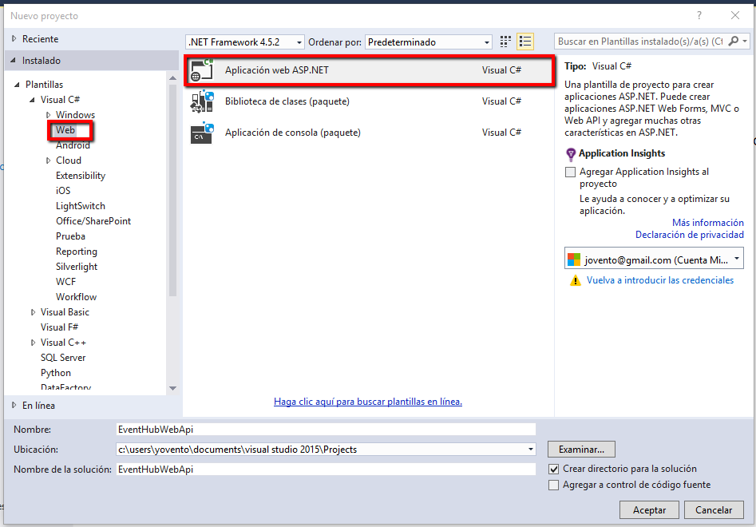
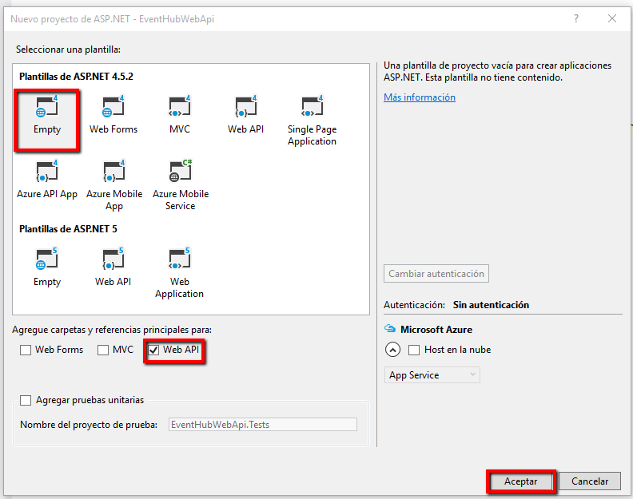
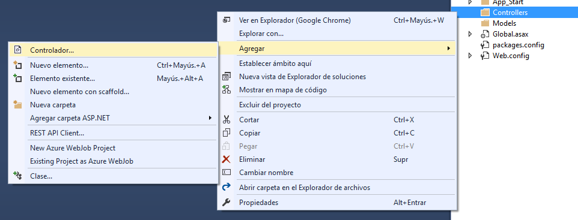
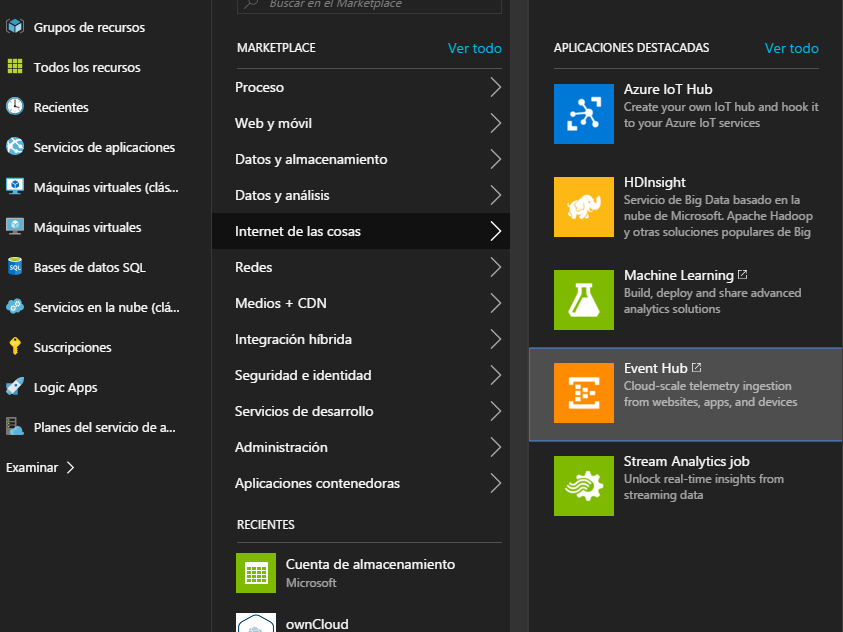
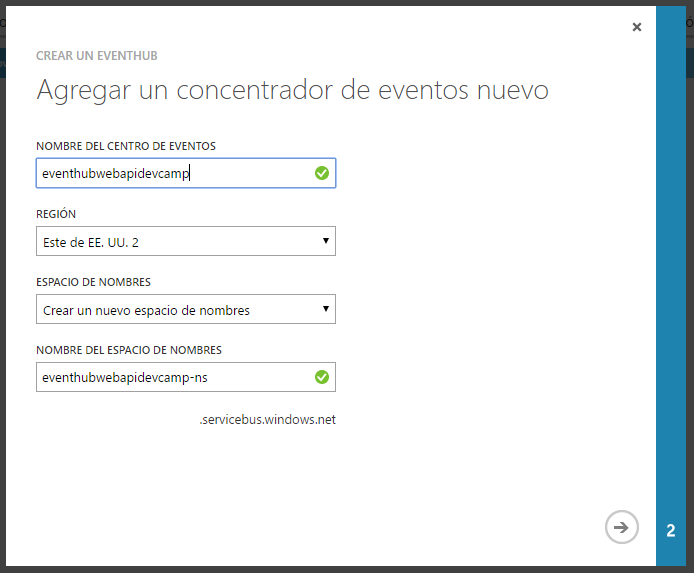
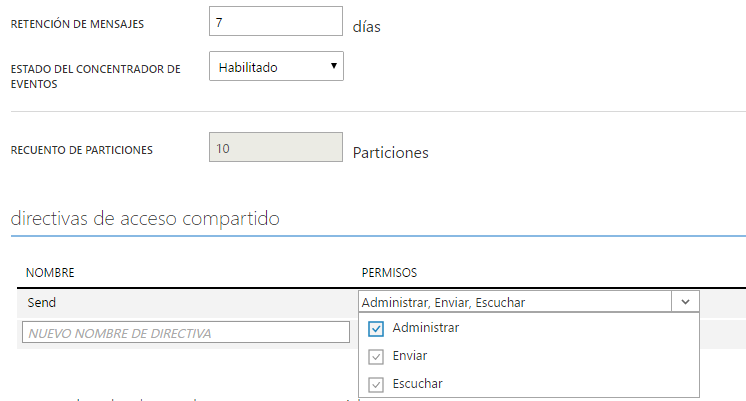
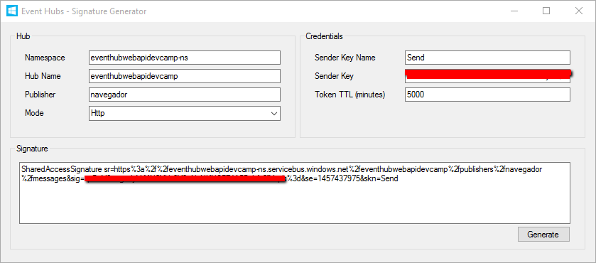

#Usar telemetría en la nube consumiendo servicios Rest

<p>
Entre las posibilidades de consumo de los EventHubs disponibles en Microsoft Azure, cabe mencionar que también podemos hacer uso de clientes HTTP para realizar el envío de comunicaciones por medio de solicitudes a una API Rest suministrada por este mismo servicio.

Este tipo de comunicaciones amplían aún más el espectro de dispositivos o incluso aplicaciones desde las cuales podemos aprovechas las funcionalidades y ventajas que tiene el uso de la telemetría como base o herramienta de analisis de información.</p>

##Objetivo del laboratorio
1. En este laboratorio crearemos una Api rest basada en WebApi 2.0 para enviar información a un EventHub de Microsoft Azure.
1. Consumiremos de igual forma por medio de un cliente Javascript el servicio de envío de mensajes de un EventHub. 


##Requisitos 

Los requisitos de este laboratorio son los siguientes. 

1. Visual Studio 2015: se construira una Api utilizando WebApi 2.0
1. Una cuenta de Azure Activa ( si no tiene una puede acceder a una gratis <b>Azure Free Trial</b> )

##Parte 1 - Consumo desde WebApi con Httpclient

Empezaremos por la creación del proyecto que finalmente se convertirá en nuestra Api de consumo Rest para comunicación con el EventHub.

1. Lo primero que debemos crear es un proyecto nuevo web en VS 2015. Seleccionando la plantilla <b>Blank App</b>, también marcaremos WebApi para agregar estas referencias principales a nuestro proyecto, para el este caso llamaremos el proyecto <b>EventHubWebApi</b>

	

    

1. De esta forma ya tendremos nuestro proyecto de Api básico creado, a continuación agregamos un controlador llamado <b>EventHubController</b>, con esto tendremos también creada una clase llamada <b>EventHubController</b> aquí es donde tendremos nuestro método de comunicación con el EventHub 

	

##TAREA 1:  Crear el EndPoint y el método de comunicación

1. Agregaremos el método <b>SendHttpMessage</b> que realizará la comunicación con nuestro EventHub 

	```csharp
	   public HttpResponseMessage SendHttpMessage(string message)
        {

            var url = string.Format("{0}/publishers/{1}/messages", hubName, "navegador");

            var httpClient = new HttpClient
            {
                BaseAddress = new Uri(string.Format("https://{0}.servicebus.windows.net/", serviceNamespace))
            };

            httpClient.DefaultRequestHeaders.TryAddWithoutValidation("Authorization", sas);

            var content = new StringContent(message, Encoding.UTF8, "application/json");

            content.Headers.Add("ContentType", "application/atom+xml;type=entry;charset=utf-8");

            var response = httpClient.PostAsync(url, content).Result;

            return response;

        }
			
	```
1. Lo siguiente es crear la función de entrada de la Api la cual finalmente será la encargada de ejecutar la lógica de comunicación con el EventHub, creamos entonces la función <b>sendMessage</b> que escucha por medio del verbo Post 

	```csharp
	[HttpPost]
    public IHttpActionResult sendMessage(string value)
    {
        try
        {
            var response = SendHttpMessage(value);

            if (response.IsSuccessStatusCode == true)
            {
                return Ok("-- Mensaje enviado");
            }
            else
            {
                return Ok("-- Comunicación fallida");
            }

        }
        catch (Exception ex)
        {
            return InternalServerError(ex);
        }

    }
	```

1. A continuación crearemos unas variables globales que almacenarán los datos básico de acceso a nuestro EventHub. 

	```csharp
	private static readonly string sas = "SharedAccessSignature sr=https%3a%2f%2feventhubwebapidevcamp-ns.servicebus.windows.net%2feventhubwebapidevcamp%2fpublishers%2fnavegador%2fmessages&sig=OlDNMPMM6i6BM%2bkByFga6PWESmCb3wJdmj5OYIUoEpM%3d&se=1457140975&skn=Send";
    private static readonly string serviceNamespace = "eventhubwebapidevcamp-ns";
    private static readonly string hubName = "eventhubwebapidevcamp";
	```

1. Recordemos que debemos agregar los espacios de nombres utilizados hasta el momento.
    ```csharp
	using System;
    using System.Net.Http;
    using System.Text;
    using System.Web.Http;
	```

1. Nuestra clase completa debe lucir similar a la siguiente 
	```csharp
	using System;
    using System.Net.Http;
    using System.Text;
    using System.Web.Http;

    namespace EventHubWebApi.Controllers
    {
        public class EventHubController : ApiController
        {
            private static readonly string sas = "SharedAccessSignature sr=https%3a%2f%2feventhubwebapidevcamp-ns.servicebus.windows.net%2feventhubwebapidevcamp%2fpublishers%2fnavegador%2fmessages&sig=OlDNMPMM6i6BM%2bkByFga6PWESmCb3wJdmj5OYIUoEpM%3d&se=1457140975&skn=Send";
            private static readonly string serviceNamespace = "eventhubwebapidevcamp-ns";
            private static readonly string hubName = "eventhubwebapidevcamp";

            [HttpPost]
            public IHttpActionResult sendMessage(string value)
            {
                try
                {
                    var response = SendHttpMessage(value);

                    if (response.IsSuccessStatusCode == true)
                    {
                        return Ok("-- Mensaje enviado");
                    }
                    else
                    {
                        return Ok("-- Comunicación fallida");
                    }

                }
                catch (Exception ex)
                {
                    return InternalServerError(ex);
                }

            }

            public HttpResponseMessage SendHttpMessage(string message)
            {

                var url = string.Format("{0}/publishers/{1}/messages", hubName, "navegador");

                var httpClient = new HttpClient
                {
                    BaseAddress = new Uri(string.Format("https://{0}.servicebus.windows.net/", serviceNamespace))
                };

                httpClient.DefaultRequestHeaders.TryAddWithoutValidation("Authorization", sas);

                var content = new StringContent(message, Encoding.UTF8, "application/json");

                content.Headers.Add("ContentType", "application/atom+xml;type=entry;charset=utf-8");

                var response = httpClient.PostAsync(url, content).Result;

                return response;

            }

        }
    }	
	```	
##TAREA 2: Creando un EventHub en Azure 

1. Para construir un <b>EventHub</b> debemos ir al [portal de azure](https://portal.azure.com) y crearlo de esta manera. 

    

    

   Al construirlo tendremos el siguiente servicio activo, desde aquí ingresamos en la opción Centro de Eventos 

    

   Desde aquí ingresamos a la opción configurar en donde especificaremos las directivas de acceso y seguridad para el EventHub, en este caso utilizaremos solo una directiva con todos los permisos y damos clic en el botón guardar.
   
    
    
   Una vez configurada la directiva de acceso, podremos visualizar las claves de uso de dichas directivas.
   
    

##TAREA 3: Preparando para enviar al EventHub  

1. Con el EventHub creado y configurado solo resta ingresar la configuración de conexión en nuestro proyecto de igual forma debemos crear la cadena de autenticación contra el EventHub, para construir está autenticación de forma fácil podemos descargar la herramienta EventHubs Signature Generator, https://github.com/sandrinodimattia/RedDog/releases/tag/0.2.0.1, en el cual ingresaremos la información de conexión a nuestro EventHub, posteriormente la cadena la reemplazaremos en el método <b>SendHttpMessage</b>

    

    ```csharp
	private static readonly string sas = "SharedAccessSignature sr=https%3a%2f%2feventhubwebapidevcamp-ns.servicebus.windows.net%2feventhubwebapidevcamp%2fpublishers%2fnavegador%2fmessages&sig=zpDXXXXXXXXXXck%2fYupk%3d&se=1457437975&skn=Send";
    private static readonly string serviceNamespace = "eventhubwebapidevcamp-ns";
    private static readonly string hubName = "eventhubwebapidevcamp";
	```

##TAREA 4: Enviando información al EventHub 

1. Finalmente al ejecutar nuestra aplicación WebApi, podremos consumirlo con cualquier cliente HTTP, para este caso lo estoy consumiendo por medio de PostMan, el valor a envíar debe ser concatenar en la solicitud al parámetro <b>value</b>. 

    

##Parte 2 - Consumo desde cliente Javascript

1. Para el cliente Javascript simplemente necesitaremos una página html en la cual crearemos una estructura simple de página que nos permita indicar un mensaje a enviar:
    
    ```Html
    <!DOCTYPE html>
    <html>
    <head>
        <meta http-equiv="Content-Type" content="text/html; charset=utf-8" />
        <title></title>
        <meta charset="utf-8" />
    </head>
    <body>
        <input type="text" value="0" id="value" />
        <input type="button" value="Enviar Mensaje" onclick="sendMessage()" />
        <label id="status"></label>

    </body>
    </html>
    ```

1. Añadiremos también la lógica para realizar el llamado por medio de un objeto xmlHttpRequest a nuestro EventHub 
 
    ```Javacript
    <script type="text/javascript">
        function sendMessage() {
            // Generar el token SAS por medio la herramienta EventHubs Signature Generator, https://github.com/sandrinodimattia/RedDog/releases/tag/0.2.0.1
            var sas = "SharedAccessSignature sr=https%3a%2f%2feventhubwebapidevcamp-ns.servicebus.windows.net%2feventhubwebapidevcamp%2fpublishers%2fnavegador%2fmessages&sig=zpDzV6xwgedyVtMN2YLb8Y8uNzNKNSF74A5Bck%2fYupk%3d&se=1457437975&skn=Send";

            var serviceNamespace = "eventhubwebapidevcamp-ns";
            var hubName = "eventhubwebapidevcamp";
            var deviceName = "navegador";

            var xmlHttpRequest = new XMLHttpRequest();
            xmlHttpRequest.open("POST", "https://" + serviceNamespace + ".servicebus.windows.net/" + hubName + "/publishers/" + deviceName + "/messages", true);

            xmlHttpRequest.setRequestHeader("Access-Control-Allow-Origin", "*");
            xmlHttpRequest.setRequestHeader("Access-Control-Allow-Credentials", "true");
            xmlHttpRequest.setRequestHeader('Content-Type', "application/atom+xml;type=entry;charset=utf-8");
            xmlHttpRequest.setRequestHeader("Authorization", sas);


            xmlHttpRequest.onreadystatechange = function () {
                if (this.readyState == 4) {

                    if (this.status == 201) {
                        document.getElementById('status').innerText =
                            'Enviado: ' + document.getElementById('value').value;
                    } else {
                        document.getElementById('status').innerText =
                            this.status;
                    }
                }
            };

            xmlHttpRequest.send(document.getElementById('value').value);
        }
        </script>
    ```

1. Solo falta abrir nuestra página Html, ingresar el valor del mensaje a enviar y dar clic en <b>Enviar Mensaje</b>. 

    

1. Al verificar nuevamente las estadísticas de uso de nuestro EventHub identificaremos las solicitudes realizadas desde nuestros clientes tanto, Api como Javascript:

    
