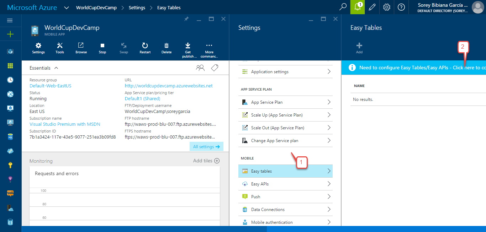
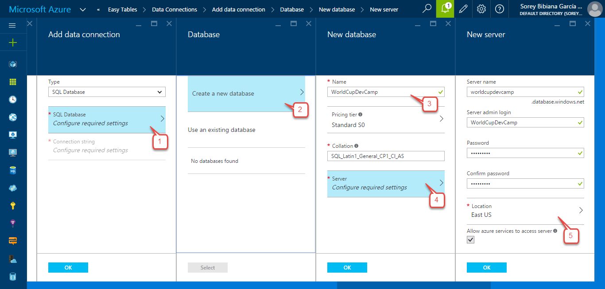
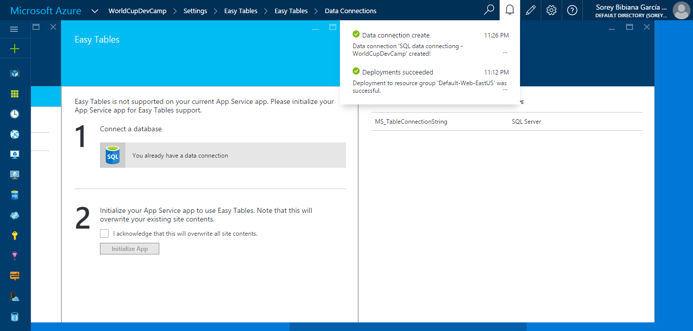
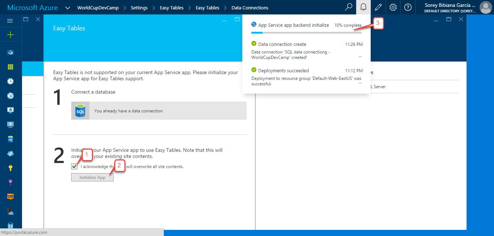
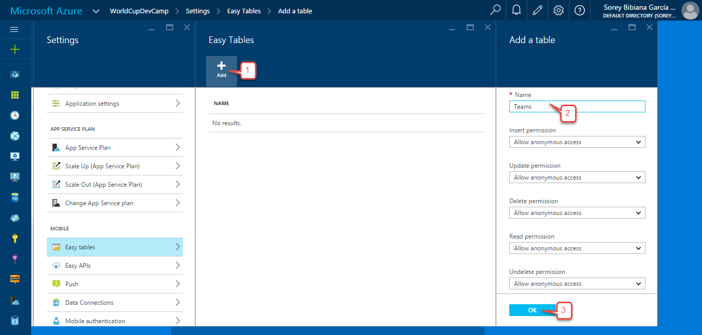
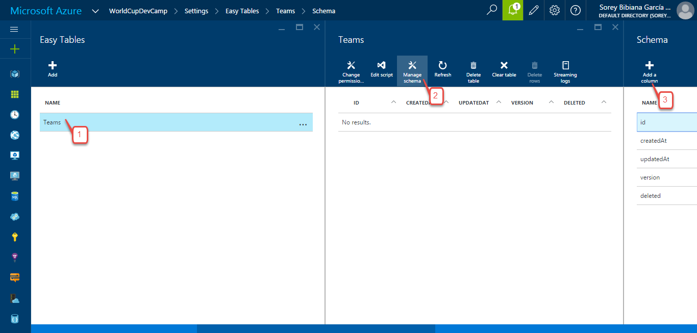
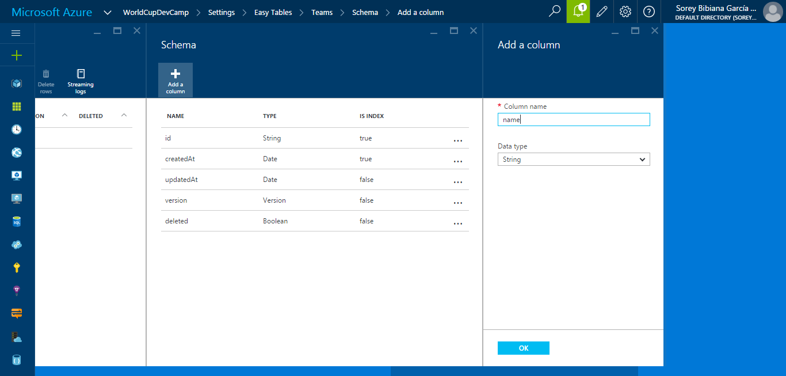
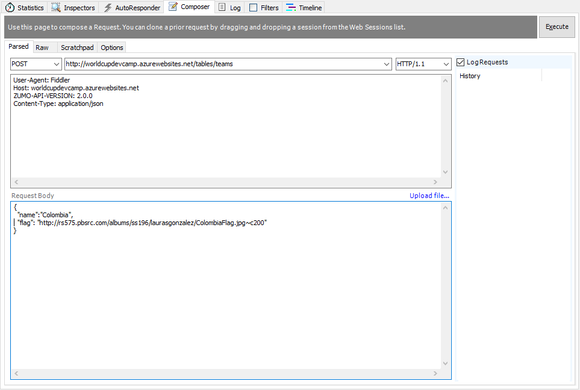
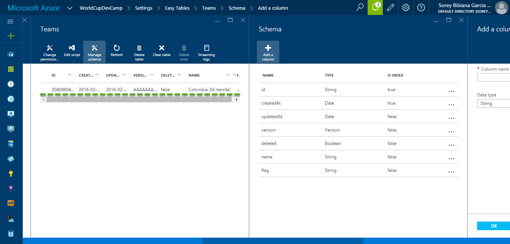

#CloudCamp Azure Easy Tables y Aplicaciones Universales
<span class="alert alert-info">
A continuación se describen los pasos correspondientes para crear un backend rápido usando Easy Tables de App Service de Azure. 

Posteriormente crearemos una app que consuma este backend en formato REST/Json usando HttpClient.


</span>

##Herramientas:

<span class="alert alert-info">Para este laboratorio necesitas:</span>

1. Visual Studio 2015 con el SDK de Windows 10
1. Una suscripción a Azure

##Comencemos:
###Parte 1: Creación del Backend con Easy Tables

1. En nuestra suscripción de Azure creamos un nuevo Mobile App siguiendo los pasos de la imagen
	
	
    
1. Cuando la aplicación sea creada se cargará el panel de administración en la zona de settings. Busca la opción Easy tables y selecciónala. En este punto se te indicará que debe realizarse una configuración para habilitar las Easy tables, da click en el mensaje que te lo indica.
	
	
    
1. A continuación se te indicarán los pasos a seguir para configurar las Easy tables: Conectarnos a una base de datos e inicializar la app.
	
	
    
1. Sigue todos los pasos para configurar una nueva base de datos, tal como se muestra en la imagen. Recuerda que debes elegir otros nombres para tu app. Presiona los botones OK del último paso al primero, las ventanas se iran cerrando una a una.
	
	
    
1. Espera que la creación de la base de datos y la conexión finalice con éxito.
	
	
    
    
    
1. Acepta los términos, presiona el botón inicializar y espera que se confirme la finalización del proceso.
	
	
    
1. Después de que el proceso finalice, quedarás ubicado en la pantalla de creación de tablas. Crea una siguiendo los pasos de la imagen. Después de presionar el botón OK espera la confirmación. Tu tabla debe aparecer en la lista.
	
	
    
1. Para adicionar columnas selecciona tu tabla y administra el esquema. Usa el botón adicional columna para añadir las que consideres.
	
	
    
    
    
    
###Parte 2: Probando las Easy Tables

1. Después de crear tu tabla podrás incluso modificar el código Node.js con que fue construido. Si, las Easy Tables son Node.js.
	
	
    
1. El editor en línea "Mónaco" te permitira cambiar el código. No tendras que hacer ningún proceso de publicación, el cambio es inmediato.
	
	

    A continuación está el código usado en el ejemplo
    ```
    var table = module.exports = require('azure-mobile-apps').table();

    table.insert(function (context) {
        if (context.item.name.indexOf("Colombia") > -1) {
            context.item.name += " ¡Mi tierrita!";
        }
        
        return context.execute();
    });
    ```    

1. En un probador web como Fiddler, podemos componer un llamado HTTP para probar que nuestra API Rest está funcionando. Debes recordar escribir ZUMO-API-VERSION: 2.0.0 como header del request http.	
	
    
    
1. Después de ejecutar vemos como el item creado tiene la modificación que insertamos en nuestro script

    
    
1. En azure podemos ver como nuestro dato fue creado, o bien haciendo una petición get por Fiddler

    
    
###Parte 3: Creando nuestra app universal 

