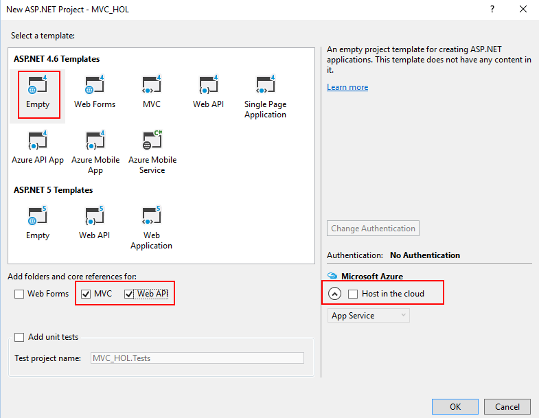

#WebApps con C-Sharp
###MVC5 - KnockOut - Bootstrap
###Conectándonos con DocumentDB

Este tutorial te permitirá conocer y manejar los conceptos y principios de desarrollo de Asp.Net MVC, al mismo tiempo te ayudará a comprender el manejo de ajax utilizando knockout, así como los conceptos de diseño utilizando Bootstrap.

AL final tendremos una aplicación modular que te permita cargar los datos de manera dinámica utilizando una base de datos NoSql Azure DocumentDB.

Para esto es necesario contar con:
- Visual Studio 2015 cualquiera de sus versiones, puedes descargar la versión gratuita [Visual Studio Community aquí](https://www.visualstudio.com/downloads/download-visual-studio-vs).
- Una cuenta de Azure (Azure Pass)
- Haber hecho el ejercicio para la creación de una Base de datos en DocumentDB [aquí](http://julito) o en este [otro link](http://DocumentDB_Miguel)

##Tareas
- [Tarea 1 - MVC 5 WebApps.](#tarea-1)
- [Tarea 2 - Crear una aplicación web ASP.Net MVC.](#tarea-2)
- [Tarea 3 - Instalando las Librerías requeridas para nuestro ejemplo.](#tarea-3)
- [Tarea 4 - Nuestro Model (Modelo).](#tarea-4)
- [Tarea 5 - Nuestro Controller (Controlador).] (#tarea-5)
- [Tarea 6 - Nuestra View (Vista).] (#tarea-6)
- [Tarea 7 - Router / Bundles / Global.asax.] (#tarea-7)
- [Tarea 8 - ApiController.] (#tarea-8)
- [Tarea 9 - Knockoutjs conectándonos con el controller.] (#tarea-9)
- [Tarea 10 - Mostrando datos en nuestra vista.] (#tarea-10)
- [Tarea 11 - Desde Cero sobre HTML.] (#tarea-11)
- [Tarea 12 - Bootstrap para nuestra UI.] (#tarea-12)
- [Tarea 13 - Vínculos de interés.] (#tarea-13)

###Tarea 1
####MVC 5 WebApps
Modelo Vista Controlador es un paradigma de programación que distribuye la carga del código con base en los 3 componentes que la integran, un resumen podría ser el de la siguiente grafica:

Otra manera de verlo sería agregando un componente Usuario al paradigma de MVC.

Se puede encontrar más información y profundizar en el tema en diferentes sitios en internet así como en publicaciones, al final dejaremos un listado de vínculos que podrían ser de interés para ésto.

###Tarea 2
####Crear una aplicación web ASP.Net MVC
Para nuestro laboratorio utilizaremos Visual Studio 2015 (VS) y utilizando el framework 4.6
1. Abrimos Visual Studio y seleccionamos la opción Crear Nuevo Proyecto y seleccionamos la opcion Web para ver las plantillas correspondientes, seleccionamos ASP.NET Web Applicacion (aplicaciones web de Asp.Net).

1. En la ventana que se abre seleccionamos la opción Empty (vacia) y dejamos sin seleccional la casilla Host in the cloud (Host en la nube). También seleccionaremos los folders y librerías que necesitamos para iniciar, en este caso MVC y Web AAPI (como se ve en la grafica de abajo) que requeriremos para nuestro trabajo y hacemos clic en OK.

1. Se abrirá nuestro ambiente de desarrollo en el que veremos las carpetas y archivos que cargó la plantilla por defecto, debería verse así:

