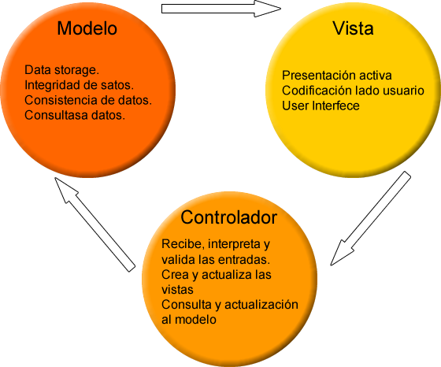
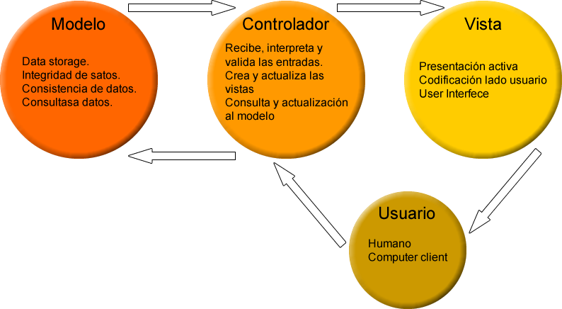
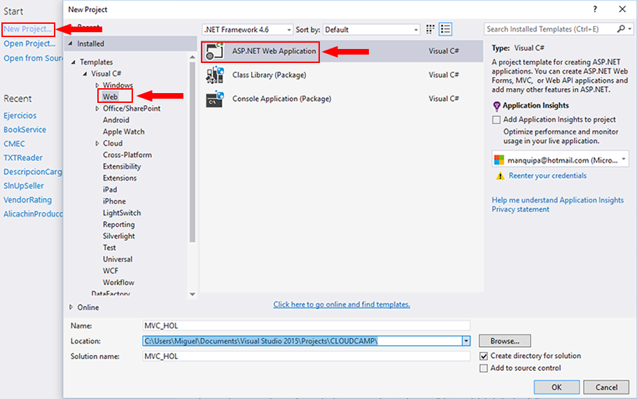
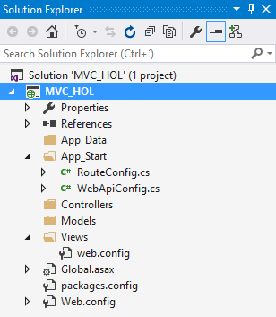
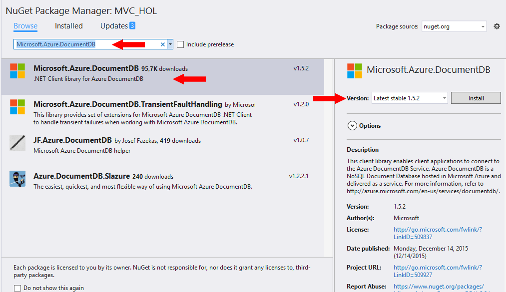
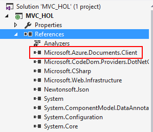
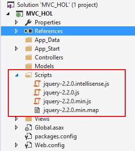
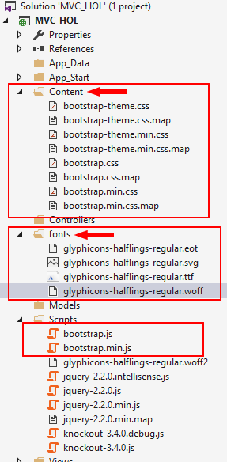

#WebApps con C-Sharp
###MVC5 - KnockOut - Bootstrap
###Conectándonos con DocumentDB

Este tutorial te permitirá conocer y manejar los conceptos y principios de desarrollo de Asp.Net MVC, al mismo tiempo te ayudará a comprender el manejo de ajax utilizando knockout, así como los conceptos de diseño utilizando Bootstrap.

AL final tendremos una aplicación modular que te permita cargar los datos de manera dinámica utilizando una base de datos NoSql Azure DocumentDB.

Para esto es necesario contar con:
- Visual Studio 2015 cualquiera de sus versiones, puedes descargar la versión gratuita [Visual Studio Community aquí](https://www.visualstudio.com/downloads/download-visual-studio-vs).
- Una cuenta de Azure (Azure Pass)
- Haber hecho el ejercicio para la creación de una [Base de datos en DocumentDB aquí](https://github.com/Ninja-Labs/azure/blob/master/6.%20WebApps%20MVC%20Core%20and%20Entity%20Framework/Lab%202/lab.md) o en este [otro link](http://DocumentDB_Miguel)

##Tareas
- [Tarea 1 - MVC 5 WebApps.](#tarea-1)
- [Tarea 2 - Crear una aplicación web ASP.Net MVC.](#tarea-2)
- [Tarea 3 - Instalando las Librerías requeridas para nuestro ejemplo.](#tarea-3)
- [Tarea 4 - Construyendo Nuestro Model (Modelo).](#tarea-4)
- [Tarea 5 - Nuestro Controller (Controlador).] (#tarea-5)
- [Tarea 6 - Nuestra View (Vista).] (#tarea-6)
- [Tarea 7 - Router / Bundles / Global.asax.] (#tarea-7)
- [Tarea 8 - ApiController.] (#tarea-8)
- [Tarea 9 - Knockoutjs conectándonos con el controller.] (#tarea-9)
- [Tarea 10 - Mostrando datos en nuestra vista.] (#tarea-10)
- [Tarea 11 - Desde Cero sobre HTML.] (#tarea-11)
- [Tarea 12 - Bootstrap para nuestra UI.] (#tarea-12)
- [Tarea 13 - Vínculos de interés.] (#tarea-13)

###Tarea 1
####MVC 5 WebApps
Modelo Vista Controlador es un paradigma de programación que distribuye la carga del código con base en los 3 componentes que la integran, un resumen podría ser el de la siguiente grafica:

Otra manera de verlo sería agregando un componente Usuario al paradigma de MVC.

Se puede encontrar más información y profundizar en el tema en diferentes sitios en internet así como en publicaciones, al final dejaremos un listado de vínculos que podrían ser de interés para ésto.

###Tarea 2
####Crear una aplicación web ASP.Net MVC
Para nuestro laboratorio utilizaremos Visual Studio 2015 (VS) y utilizando el framework 4.6

- Abrimos Visual Studio y seleccionamos la opción Crear Nuevo Proyecto y seleccionamos la opcion Web para ver las plantillas correspondientes, seleccionamos ASP.NET Web Applicacion (aplicaciones web de Asp.Net).

- En la ventana que se abre seleccionamos la opción Empty (vacia) y dejamos sin seleccional la casilla Host in the cloud (Host en la nube). También seleccionaremos los folders y librerías que necesitamos para iniciar, en este caso MVC y Web API (como se ve en la grafica de abajo) que requeriremos para nuestro trabajo y hacemos clic en OK.

- Se abrirá nuestro ambiente de desarrollo en el que veremos las carpetas y archivos que cargó la plantilla por defecto, debería verse así:

###Tarea 3
####Instalando las Librerías requeridas para nuestro ejemplo
Para nuestro proyecto requerimos instalar o actualizar las libresrías que necesitaremos y son:
-- DocumentDB
-- NewtonSoft
-- jQuery
-- Knockoutjs
-- Bootstrap

- Aunque hay diferentes formas de cargar las librerías que requerimos, en este proyecto vacio vamos a cargarlas utilizando NuGet Packages (Paquetes NuGet), para esto hacemos clic derecho sobre <strong>References</strong> y hacemos clic sobre la opción Manage Nuget Packages.

- Para las ultimas versiones de VS se abrirá la ventana que permitirá seleccionar si lo que queremos es buscar (Browse), ver los paquetes instalados (Installed), o que paquetes pueden ser actualizados (Updates). Seleccionaremos la opción Browse.

- En la caja de texto de búsqueda escribiremos DocumentDB para buscar la librería correspondiente, escribiremos Microsoft.Azure.DocumentDB y al resultado seleccionaremos la opción Microsoft.Azure.DocumentDB y dejaremos la ultima versión estable que aparezca en el listado de la derecha.

- Hacemos clic en Install (Instalar) y los aceptamos (clic en OK y Aceptar) en las ventanas emergentes que aparezcan.

Al revisar en las referencias podemos ver que ha quedado instalada la referencia de Azure Document Client.

- Ahora realizaremos el mismo procedimiento para instalar los paquetes correspondientes de Newtonsoft, esto nos permitirá trabajar con formatos json dentro de nuestro sistema, requerido para comunicarnos con DocumentDB. 

Es necesario aclarar que Newtonsoft ya esta instalado dentro de la aplicación, sin embargo el procedimiento nos permitirá descargar la última versión estable del paquete. Hacemos clic sobre la opción update (Actualizar).

Si aparecen ventanas emergentes hacemos clic en OK o aceptar.

- Ahora instalaremos jQuery realizando el mismo procedimiento que hemos realizado hasta ahora escribiendo jQuery en el cuadro de texto de búsqueda del NuGet package.

Hacemos clic sobre Install (instalar), si aparecen ventanas emergentes hacemos clic en OK o aceptar.

- Debe aparecer una nueva carpeta Scripts con los archivos javascript corresponsdientes a jquery dentro de la nueva carpeta.

- El siguiente paso es instalar knockoutjs, para esto realizaremos el procesimiento de buscarlo en el NuGet packages e instalamos de la misma forma que hemos instalado los paquetes anteriores.

- Aparecen los archivos correspondientes dentro de la carpeta Scripts de nuestro proyecto.

- Ahora finalizaremos instalando el paquete de Bootstrap que utilizaremos en las tareas finales de nuestro laboratorio, el procedimiento es el mismo que con los elementos anteriores dentro del manejador de paquetes NuGet.

- Acá el resultado es especial ya que tendremos una carpeta Content que tendrá los estilos asociados con Bootstrap, una carpeta Fonts que trae unas fuentes especiales que nos permitiran implementar grifos o imágenes como si fueran fuentes de tezto y también tenemos los archivos javascript asociados a Bootstrap para poder implementar funcionalidades de diseño.

Con el procedimiento anterior, ya estamos preparados para construir nuestra aplicación.

###Tarea 4
####Construyendo Nuestro Model (Modelo)

Nos basaremos en el ejercicio realizado con [DocumentDB anterior](https://github.com/Ninja-Labs/azure/blob/master/6.%20WebApps%20MVC%20Core%20and%20Entity%20Framework/Lab%202/lab.md) del cual tomaremos el código y lo integrarémos a nuestra aplicación.

- Lo que haremos es crear la clase <strong>MovieRepository</strong> dentro de nuestra carpeta Models, haciendo clic derecho sobre la carpeta y seleccionando la opción Add->New Item... (Agregar->Nuevo elemento)

- Trabajaremos con 'C#'

